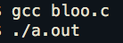
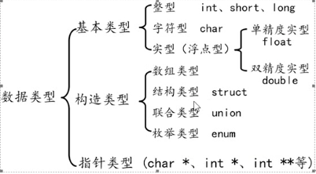
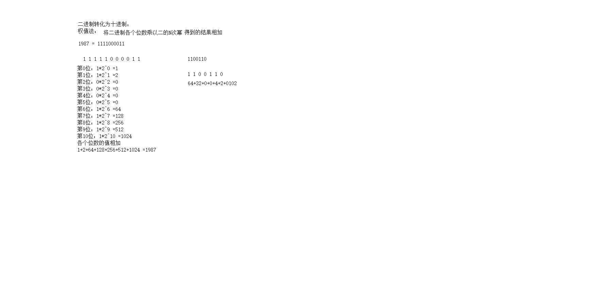
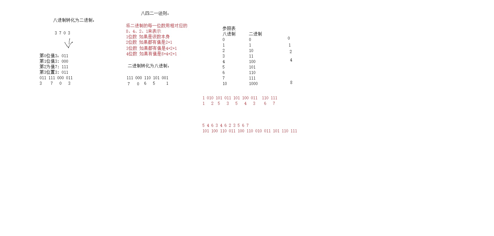
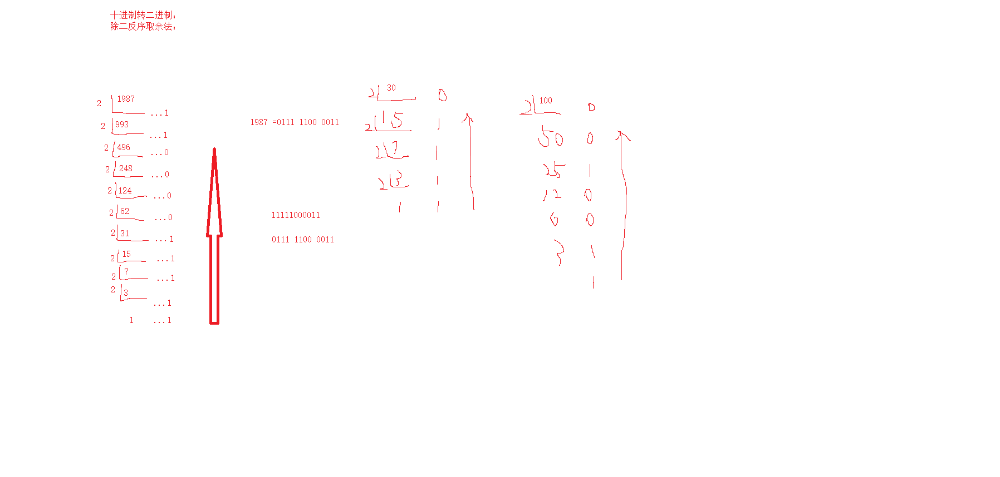
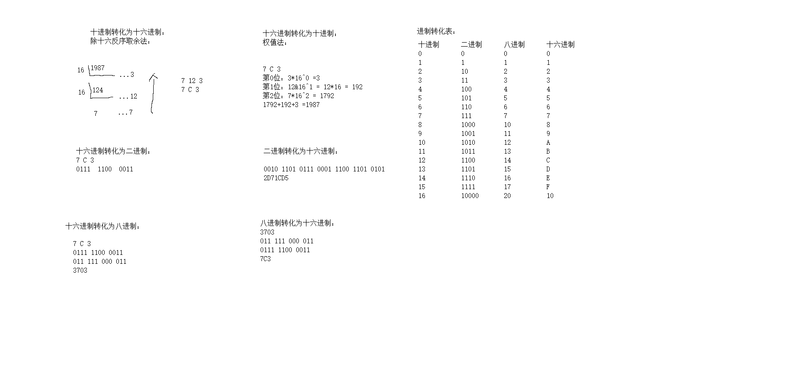
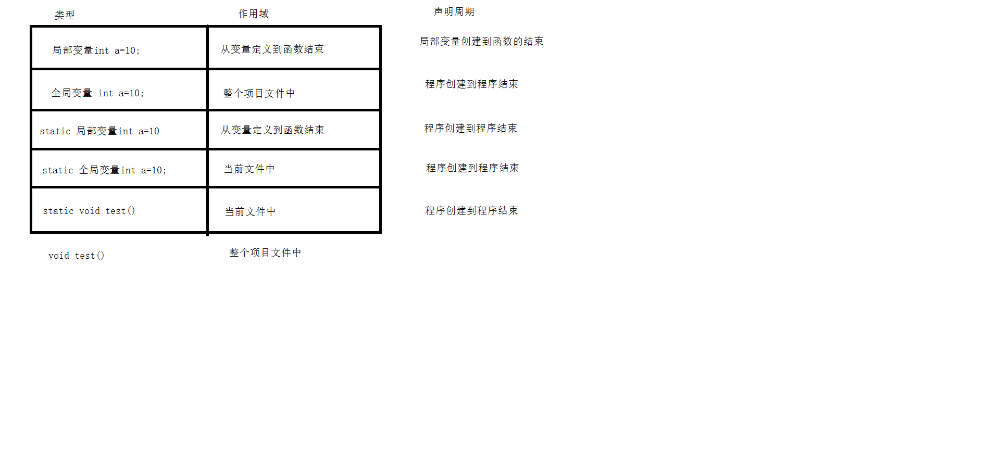
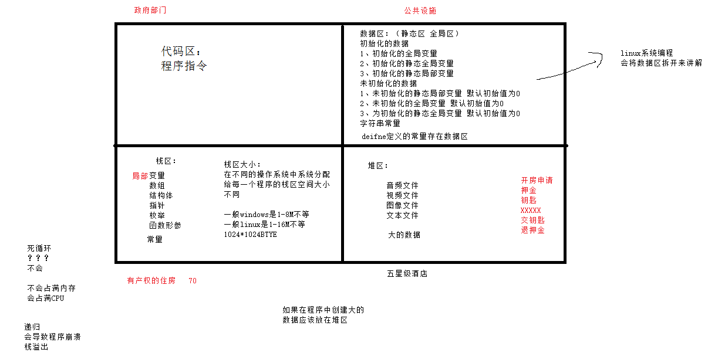

---

---

# **c语言**

##### **32个关键字（<u>由系统定义，不能重做其他定义</u>）**

| **auto**     | **break**  | **case**   | **char**    | **const**    | **continue** |
| ------------ | ---------- | ---------- | ----------- | ------------ | ------------ |
| **default**  | **do**     | **double** | **else**    | **enum**     | **extern**   |
| **float**    | **for**    | **goto**   | **if**      | **int**      | **long**     |
| **register** | **return** | **short**  | **signed**  | **sizeof**   | **union**    |
| **static**   | **struct** | **switch** | **typedef** | **unsigned** | **void**     |
| **volatile** | **while**  |            |             |              |              |

##### `                                                             `9种控制语句

- if（） else   
- for（）  
-  while（）
- do   while（）
- continue
- break
- switch
- goto

##### 34种运算符

*现在没图 找到再说*

##### hello word.c

```c
#include <stdio.h>
//导入标准的输入输出库（是系统库）
int main(void)
{
​    printf("i love nkmrtmy\n");
​    return 0;//0-函数返回值 要和前面定义的类型一致
}
```

```c
/*
#表示包含 
.c表示源文件 
.h表示头文件 
std标准库 
i-input 
o-output  
“”自定义头文件用这个引起来
int是函数的返回值类型
main-主函数 
void-函数的参数类型表示空类型 可以不写 
int main（int argc，char *argv[]）argc-函数的参数记录个数是int类型的，具体的记录在argv数组中，是指针类型的数组
一个程序有且只能有一个主函数 
一组{}括起来的是程序题/代码体/函数体 
printf-打印函数 “”中的是字符串常量 \n-换行 \-转义字符 \t-跳制表符 
printf("文字：%d\n,value")格式
主函数中遇到return代表程序结束
；代表一条语句的结束
*/

```

##### gcc编译器

将代码转为电脑可以看懂的语句即用编辑器编写程序再用编译器编译程序后由电脑运行

编译命令格式

gcc  文件名.c  or g++ 文件名.c

eg. 

gcc、g++编译常用选项说明：

| 选项    | 含义                       |
| ------- | -------------------------- |
| -o file | 指定生成的输出文件名为file |
| -E      | 只进行预处理               |
| -S      | 只进行预处理和编译         |
| -c      | 只进行预处理、编译和汇编   |

##### system函数

在已经运行的程序中执行另一个外部程序（系统自带的）

参数为外部可执行程序的名字

返回值：

成功-不同系统不一样

失败-一般是-1

```c
#include <stdlib.h>
int main()
{
  system("")
}
```

```c
#include <stdlib.h>
#include <stdio.h>
int main()
{
  int value = system("");
  printf("文字：%d\n,value");
  return 0;
}
```

### 程序编译和执行过程

| 预处理       | gcc -E hello.c -o hello.i        |
| ------------ | -------------------------------- |
| **编    译** | **gcc -S hello.i -o hello.s**    |
| **汇    编** | **gcc -c hello.s -o hello.o**    |
| **链    接** | **gcc     hello.o -o hello_elf** |

##### 编译具体操作

预处理：宏定义展开、头文件展开、条件编译等，同时将代码中的注释删除，这里并不会检查语法。

编译：检查语法，将预处理后文件编译生成汇编文件

汇编：将汇编文件生成目标文件（二进制文件）机器语言

链接：c语言写的程序是需要依赖各种库的，所以编译之后还需要把库链接到最终的可执行程序中去。

##### 执行具体操作

编译后的可执行程序存在外存储器中

唤醒到内存储器中，编译时会有不同部分，存储时也存在不同部分（代码区，数据区，栈区，堆区）

从内存中通过总线传到cpu（运算器，控制器，寄存器）中，再回去

### cpu与内存

- 寄存器是cpu内部最基本的存储单元
- cpu对外是通过总线（地址、控制、数据）来和外部设备交互的，总线的宽度是8位，同时cpu的寄存器也是8位，那么这个cpu就叫8位cpu（如果总线是32位，寄存器也是32位的，那么这个cpu就是32位的）
- 有一种cpu内部寄存器是32位的，但是总线是16位叫做准32位cpu
- 所有的64位cpu兼容32位的指令，32位要兼容16位的指令，所以在64位的cpu上可以识别32位的指令
- 在64位的cpu构架上，运行了32位的软件操作系统，那么这个系统就是32位的
- 64位的软件不能运行在32位的cpu上

##### 寄存器、缓存、内存三者关系

按与cpu远近来分，离得最近的是寄存器，然后是缓存，最后是内存

cpu计算时，先预先把要用的数据从硬盘读到内存，然后再把即将要用的数据读到寄存器。即cpu<-->寄存器<-->内存。

缓存的作用：如果一直操作内存中的同一地址的数据，就会影响速度，所以在寄存器和内存之前设置一个缓存

从缓存提取的速度远高于内存（缓存价格远高于内存

所以，从远近来看：cpu<-->寄存器<-->缓存<-->内存

#### 汇编语言

```c
#include <stdio.h>
int main()
{
  int a;
  int b;
  int c;
  //a = 10;
  //b = 20;
  //c = a + b;
  //汇编代码
  __asm
  {
    mov a,3
    mov b,4
    mov eax,a
    mov eax,b
    mov c,eax
  }
  printf("a=%d\n",a);
  printf("b=%d\n",b);
  printf("c=%d\n",c);
  return 0;
}
```

##### 快捷键

| **`command+K`，`command+F`** | **自动格式化代码** |
| ---------------------------- | ------------------ |
| **`command+/`**              | **注释代码**       |
| **`fn+F9`**                  | **设置断点**       |
| **`fn+F5`**                  | **调试**           |
| **`command+control+F`**      | **全屏**           |

##### 一个错误类型（linux不会出现错误

```c
#include <stdio.h>
int main()
{
  int a;
  scanf("%d",&a);//键盘输入赋值
  printf("%d\n",a);
  return 0;
}
```

可能会出现错误由于scanf的不安全行为 

解决办法：

#define _CRT_SECURE_NO_WARNINGS放在文件第一行；

#pragram warning（disable：4996）不需要在第一行；

## 数据类型

##### 32个关键字（前面有

- 数据类型关键字（12个）

  char，short，int，long，float, double,unsigned,signed,struct,union,enum,void

- 控制语句关键字（12个）

  If,else,switch,case,default,for,do,while,break,continue,goto,return

- 存储类关键字（5个）

  auto,extern,register,static,const

- 其他关键字（3个）

  sizeof,typedef,volatile

#### 数据类型分类



#### 数据类型的定义

##### 变量的定义：

数据类型 变量名【标识符】

变量的赋值：变量名 = 值；

数据类型 变量名【标识符】 = 值

##### 标示符的命名规则：

1、由字母、数字、下划线组成
2、不能以数字开头
3、见名知义
4、不能和同一函数内的其他标示符重复
5、不能使用C语言关键字（可以和c++里的重复）
6、区分大小写

##### 常量（只读变量）的定义：

1、const 数据类型 常量名
2、【宏定义】#deifne 常量名 值（更好）

###### attention：

1、通过#define 定义的常量 是根据值来匹配数据类型的
2、const 修饰的常量是不安全的  它可以通过指针来修改

#### 进制

##### 二进制：（BIN）

逢二进一，所有的数组由0、1组成

##### 十进制（DEC）转二进制：

除二反序取余法：将十进制数每次除以2 取出余数 按照结果倒叙依次获取结果

##### 二进制转十进制：

权值法：将二进制数各个位数从0位开始乘以2的N幂 将各个位数的结果相加

##### 八进制：（OCT）

逢八进一，所有的数组是0到7组成

##### 十进制转八进制：

除八反序取余法：将十进制数每次除以8 取出余数 按照结果倒叙依次获取结果

##### 十六进制：（HEX）

逢十六进一，所有的数组是0到9和A到F组成 字母不区分大小写

##### 十进制转八进制：

除十六反序取余法：将十进制数每次除以16 取出余数 按照结果倒叙依次获取结果

##### 8421法则：

将各个位数的二进制用十进制中的【数字 】来表示多位的二进制数 通过【数字 】相加就可以得到二进制数的数据










##### 进制在程序中打印：

```c
int a=10;//十进制中的10
int b=010;//八进制中的10 在程序中定义一个八进制数需要在数前面加上0区分
int c=0x10;//十六进制中的10 在程序中定义一个十六进制数需要在数前面加上0x区分
int d=0X10;//十六进制中的10 在程序中定义一个十六进制数需要在数前面加上0X区分
```

<u>attention：</u>

在程序中没有办法表示一个二进制数

`%d` 将数据按照十进制输出
`%o`将数据按照八进制输出
`%x`将数据按照十六进制小写输出
`%X`将数据按照十六进制大写输出

#### 内存中数据存储方式：

一个有符号的整型数据可以分为两部分一部分是符号位、一部分是数字位，无符号数据类型只包含数字位部分

`signed int a= 1986`（有符号标识 signed可以不用写）

无符号：`unsigned int a= 1986`

##### 原码：

最高位为符号为，0表示正，1表示负；

其他数值部分就是数值本身绝对值的二进制数；

负数的原码是在其绝对值的基础上，最高位变为1

原码不方便计算

<u>eg：</u>

 1986原码：0000 0000 0000 0000 0000 0111 1100 0010
-1986原码：1000 0000 0000 0000 0000 0111 1100 0010

##### 反码：

正数的原码、反码相同

负数，符号位不变，其余位取反

<u>eg：</u>

 1986反码：0000 0000 0000 0000 0000 0111 1100 0010
-1986反码：1111 1111 1111 1111 1111 1000 0011 1101

##### 补码：

计算机系统中，数值一律使用补码来存储

对于正数，原码、反码、补码都相同；

对于负数，补码为反码加1；

补码符号位不动，其他位求反，最后整个数加1，得到原码

<u>eg：</u>

 1986补码： 0000 0000 0000 0000 0000 0111 1100 0010
-1986补码：1111 1111 1111 1111 1111 1000 0011 1110
 1986+（-1986）：1 0000 0000 0000 0000 0000 0000 0000 0000

###### 溢出：

在数据进行操作的时候会导致超出数据类型大小，会向前位进1，多于原始数据类型大小，会被系统自动舍弃 保留从后面开始数据类型大小的位数

用补码是因为：不管以原码还是反码0都有两种方法存储，用补码只有一种

###### sizeof（）

计算一个数据类型在内存中所占的大小，单位是一个字节（一个字节byte=8个bit（位），字节是计算机中存储的最小单位）

`int value  =sizeof(变量名)常量名也可`

`int value = sizeof(数据类型)or sizeof 数据类型`

char（字符型）【1】<short(短整型)【2】<=int(整型)【4】|float （单精度浮点型）【4】|long（长整型）【4】<long long(长长整型）【8】|double(双精度浮点型)【8】<u>（32位的操作系统）</u>（long 在Windows为4字节，在Linux（32位）为4字节，在64位中为8字节）

<u>attention：</u>

long类型整数的长度不能短于int类型，short类型整数的长度不能长于int类型；

数值溢出：一个小的数据类型赋值给一个大的数据类型，不会出错，因为编译器会自动转化。但一个大的数据类型赋值给一个小的数据类型，就有可能丢失高位。

#### 练习：用生辰年份年减去生辰日期

1992
-326
1、将10进制转化为二进制
     1992 ：0000 0000 0000 0000 0000 0111 1100 1000
      -326 ：0000 0000 0000 0000 0000 0001 0100 0110
2、加符号位将数据变为原码
     1992 ：0000 0000 0000 0000 0000 0111 1100 1000
      -326 ：1000 0000 0000 0000 0000 0001 0100 0110
3、转化为反码
     1992 ：0000 0000 0000 0000 0000 0111 1100 1000
      -326 ：1111 1111 1111 1111 1111 1110 1011 1001
4、将反码+1转化为补码
     1992 ：0000 0000 0000 0000 0000 0111 1100 1000
      -326 ：1111 1111 1111 1111 1111 1110 1011 1010
5、计算补码
     1992 ：0000 0000 0000 0000 0000 0111 1100 1000
      -326 ：1111 1111 1111 1111 1111 1110 1011 1010
      结果  :  1 0000 0000 0000 0000 0000 0110 1000 0010
6、将数据转化为10进制
110 1000 0010
2+128+512+1024 = 1666

#### 整型int

无符号整型取值：0-4294967295（2^32-1）

 无符号的字符型：0-255

```c
#include <stdio.h>
int main()
{
	int a=10;
	//sizeof()求出数据类型在内存中占字节（Byte）大小
	int len1 = sizeof(a);
	//单精度浮点型
	float b = 3.14;
	//字符型
	char c = 'A';
	//双精度浮点型
	double d = 5.12;
	//短整形
	short e = 10;
	//长整型
	long f = 10;
	//长长整形
	long long g=10;
	int len2 = sizeof(b);
	int len3 = sizeof(c);
	int len4 = sizeof(d);
	int len5 = sizeof(e);
	int len6 = sizeof(f);
	int len7 = sizeof(g);
	printf("%d\n",a);
	printf("int =%d\n",len1);
	printf("float =%d\n",len2);
	printf("char = %d\n",len3);
	printf("double = %d\n",len4);
	printf("short = %d\n",len5);
	printf("long = %d\n",len6);
	printf("long long = %d\n",len7);
	return 0;
}
```

```c
#include <stdio.h>

int main()
{
	//十进制数10
	int a=10;
	printf("%X\n",a);
	//八进制
	int b=010;
	printf("%X\n",b);
	//十六进制
	int c=0X10;
	printf("%X\n",c);
	return 0;
}
```

```c
#include <stdio.h>

int main()
{
  int a = 123;//定义变量a，以10进制方式赋值为123
  int b = 0567;//定义变量b，以8进制方式赋值为0567
  int c = 0xabc;//定义变量c，以16进制方式赋值为0xabc
  
  printf("a= %d\n",a);
  printf("8进制b = %o\n",b);
  printf("10进制b = %d\n",b);
  printf("16进制c = %x\n",c);
  printf("16进制c = %X\n",c);
  printf("10进制c = %d\n",c);
  
  unsigned int d = 0xffffffff;//定义无符号变量d，以16进制方式赋值
  printf("有符号方式打印d = %d\n",d);
  printf("无符号方式打印d = %u\n",d);
  return 0;
  
}
```

`scanf("%d",&a);//要输入有符号的10进制数`

| 整型常量    | 所需类型           |
| ----------- | ------------------ |
| 10          | int                |
| 10l，10L    | long               |
| 10ll,10LL   | long long          |
| 10u,10U     | unsigned int       |
| 10ul,10UL   | unsigned long      |
| 10ull,10ULL | unsigned long long |

| 打印格式 | 含义               |
| -------- | ------------------ |
| %hd      | short              |
| %d       | int                |
| %l       | long               |
| %ll      | long long          |
| %hu      | unsigned short     |
| %u       | unsigned int       |
| %lu      | unsigned long      |
| %llu     | unsigned long long |

#### 字符型 char

字符型变量只能存一个字符（一个汉字是两个字节，所以不行）

###### 输出：

`printf（“%c\n”,变量）//打印字符`

`printf("%d\n",变量)//打印字符所对应的ASCII值`

or

`putchar（a）// 结果a，只能输出字符`

###### 输入：

`scanf（“%c”，&变量）`

`变量 = getchar（）`


#### 实型（浮点型） float、double

`%f`  输出小数，默认保存6位小数，`%.2f` 保存两位小数

###### 赋值方式：

`float a= 3.14f//或者3.14F`

`double b= 3.14`

`a = 3.2e3f//科学技术法赋值表示3.2*1000`

`a = 100e-3f//100*0.001`

`a = 3.1415926f//会自动四舍五入`

#### 类型限定符

| 限定符   | 含义                                                         |
| -------- | ------------------------------------------------------------ |
| extern   | 声明一个变量，extern声明的变量没有建立存储空间               |
| const    | 定义一个常量，值不能修改                                     |
| volatile | 防止编译器优化代码                                           |
| register | 定义寄存器变量，提高效率，register是简易型的指令，而不是命令型的指令，如果CPU有空闲寄存器，那么register就生效，如果没有空闲寄存器，那么register就无效 |

## 运算符与表达式

### 常用运算符分类：

| 运算符类型   | 作用                             |                                       |
| ------------ | -------------------------------- | ------------------------------------- |
| 算术运算符   | 处理四则运算                     | +  -  *  /  %  ++( 自增 )  --（自减） |
| 赋值运算符   | 将表达式的值赋给变量             | =  +=  -=  *=  /=  %=                 |
| 比较运算符   | 比较表达式，并返回一个真值或假值 | >  <  >=  <=  ==  !=                  |
| 逻辑运算符   | 根据表达式的值返回真值或假值     | ！ &&  \|\|                           |
| 位运算符     | 处理数据的位运算                 |                                       |
| sizeof运算符 | 求字节长度                       |                                       |

<u>在计算机中用1表示真 用0表示假</u>

！【非】    非真为假 非假为真
&&【与】  同真为真 其余为假
||【或】 同假为假 其余为真

**表达式：**

通过变量或者常量和运算符连接起来成为表达式  在程序中表达式的结果可以作为程序的条件出现

#### 运算符优先级

非 乘除 加减 比较 与或 赋值 逗号

### 类型转换

1、隐式转换

编译器会自动将低的数据类型转成高的数据类型，转化后的数据正确

2、强制转化

需要程序根据实际用途去转化，得到的结果可能会省略部分的值

`int a；`

`float b = （float）a；`

### 程序流程结构

顺序结构：程序顺序执行，不发生跳转

选择结构：根据是否满足条件，有选择的执行相应功能

循环结构：根据条件是否满足，循环多次执行某代码

#### 选择结构

##### if语句

格式1：

```c
if(表达式)
{代码}  
```

如果表达式为真 执行括号内代码

格式2：

```c
if（表达式）
{代码}
else 
{代码}
```

如果表达式为真 执行if括号内代码  如果为假执行else{}内代码

格式3：

```c
if（表达式1）
{代码} 
else if（表达式2）
{代码}
else if（表达式3）
{代码}
else
{代码}
```

**练习**：三只小猪称体重

```c
#include <stdio.h>
int main()
{
  int a,b,c;
  scanf("%d%d%d",&a,&b,&c);
  if(a>b)
  {
    if(a>c)
    {
      printf("a重：%d\n",a);
    }
    else
    {
      printf("c重：%d\n",c);
    }
  }
  else
  {
    if(b>c)
    {
      printf("b重：%d\n",b);
    }
    else
    {
      printf("c重：%d\n",c);
    }
  }
  return 0;
}
```

##### 三目运算符

格式：

```c
表达式 ？选项1（表达式）：选项2（表达式）
```

 

如果表达式为真 选择选项1的结果 如果为假选择选项2的结果

```c
int a = 10;
int b = 20;
int c = a > b ? a : b;
//如果a大于b，那么c就等于a；如果a小于b，那么c就等于b
```

**练习**用三目运算符写小猪体重

```c
#include <stdio.h>
int main()
{
  int a,b,c;
  scanf("%d%d%d",&a,&b,&c);
  int d = a > b ? (a > c ? a : c) :(b > c ? b: c);
  printf("%d\n",d);
  return 0;
}
```

##### switch语句

格式：

```c
switch（表达式）
{
  case 值1：
    代码
    break；
  case 值2：
    代码；
    break；
  default:
    代码；
    break;
}
```

<u>attention：</u>

if条件语句执行效率差 switch 条件语句执行效率高；

 if可以判断一个区间 switch用来判断一个值；

三目运算符结构简单明了

#### 循环结构

##### while语句

先判断再执行

```c
while (表达式)
{
  代码（满足表达式）
}
其他代码（不满足表达式）
```

**练习**从1到100  所有7的倍数 带7的全部略过   17  71

1、循环
2、条件判断
3、跳出本次循环，继续下次循环

```c
#include <stdio.h>
int main
{
  int index = 0;
  while(index <= 100)
  {
    index++;
    if(index%7==0||index%10==7||index/10==7)
    {
      continue;
    }
    printf("%d\n",index);
  }
}
```

##### do while语句

先执行语句再进行循环判断

如果while不足以让程序结束，可以在do中加continue或break跳出

```c
do
{
  代码
}while(表达式);
```

**练习** 水仙花数：100到999所有三位数的各个位数的立方和等于该数本身那么这个数就是一个水仙花数

```c
#include <stdio.h>
int main
{
  int index = 100;
  do
  {
    int a,b,c;
    a = index/100;
    b = index/10 % 10;
    c = index%10;
    if(a*a*a +b*b*b +c*c*c == index)
    {
      printf("%d是水仙花数\n",index);
    }
    index++;
  }while(index<1000);
}
```

##### for语句

```c
for(初始值;表达式(判断);表达式(在代码运行后运行))
{
  代码
}
```

```c
#include <stdio.h>
int main
{
  for(int i = 0;i < 10;i++)
  {
    printf("%d\n",i);
  }
  return 0;
}
```

**练习**水仙花数

```c
#include <stdio.h>
int main
{
  for(int i = 100;i < 1000;i++)
  {
    int a,b,c;
    a = i/100;
    b = i/10 % 10;
    c = i%10;
    if(a*a*a +b*b*b +c*c*c == i)
    {
      printf("%d是水仙花数\n",i);
    }
  }
  return 0;
}
```

##### 嵌套循环

外层循环控制行，内层循环控制列

```c
for(初始值;表达式(判断);表达式)
{
  for(初始值;表达式(判断);表达式)
  {
    代码
  }
}
```

**练习**打印99乘法表 按照格式

`1*1=1 
1*2=2  2*2=4
1*3=3  2*3=6  3*3=9`

```c
for（int i=1;i<=9;i++)
{
  for(int j=1;j<=i;j++)
     {
       printf("%d*%d=%d ",j,i,j*i);
     }
  printf("\n");
}
```

按照格式（金字塔形）

嵌套循环 打印空格和*

 `        1*1=1 
    1*2=2  2*2=4
1*3=3  2*3=6  3*3=9`

```c
for(int i = 1;i<= 10;i++)
{
  for(int j = 1;j<= 10-i,j++)
  {
    printf(" ");
  }
  for(int k =1;k <= i*2-1;k+=)
  {
    printf("*");
  }
  printf("\n");
}
```

**练习**猜数字

猜1-100之内的数 如果你猜的数小于【数字】提示你输入的数字太小了；如果你猜的数大于【数字】提示你输入的数字太大了；如果你的输入的数字等于【数字 】  提示恭喜你猜对了，程序退出

##### 使用随机数

1、导入头文件 time.h   `#include <time.h>`
2、生成随机数种子 每次生成的随机数不一样
3、生成随机数 

```c
#include <stdio.h>
#include <time.h>
#include <stdlib.h>
#define random(x) (rand()%x+1)//宏定义随机数
int main()
{
  srand((int)time(0));//生成随机数种子
  int num = random(100);//1-100
  int value;
  for( ; ; )
  {
    printf("请输入一个整数\n");
    scanf("%d",&value);
    if(value > num)
    {
      printf("你输入的数太大了\n");
    }
    else if(value < num)
    {
      printf("你输入的数太小了\n");
    }   
    else
    {
      printf("恭喜你猜对了\n");
    }
  }
  return 0;
}
```

#### 跳转语句

##### break语句

switch语句和循环语句中都可以使用break语句

在switch语句中，可以终止某个case并跳出switch结构

在循环语句中，可以跳出当前内循环语句，执行后面的代码

在嵌套循环中，可以跳出最近的内循环语句，执行后面的代码

##### continue语句

在循环语句中，可以立即终止本次循环，并执行下一次循环

##### goto语句

无条件跳转，尽量少用

```c
goto here；
代码1
here
代码2
```

直接跳到代码2

## 数组和字符串

### 数组的定义与使用

`变量名[数字]//定义这么多个相同类型的变量`

数组下标是从0开始的 到数组元素个数-1

数组下标越界：超出了数组元素个数的下标

如果操作越界，数据会出现程序错误 1、乱码结果 2、报错

 

```c
int score[10];//定义数组
for (int i = 0;i<10;i++)
{
  score[i]=10+i;
}
//初始化数组
for (int i = 0;i<10;i++)
{
  printf("%d\n,score[i]");
}
//打印数组
```

`scanf("%d",&score[])//记得&`

求出数组元素个数：
`int （size_t） unsigned int 个数  = sizeof(数组名) / sizeof(数组元素 | 数组数据类型)` 

`int len = sizeof(score)/sizeof(int)or int len = sizeof(score)/sizeof(score[0])`

### 为数组赋值

像变量赋值一样，依次为数组赋值

如果赋值时依次为数组元素赋值，如果数组长度超过元素个数，后面的值全部初始化为0

数组元素个数不确定时，按输入元素个数算

### 数组的内存结构

求出数组地址：
`printf("%p\n",&数组名)//记得加&`
`printf("%p\n",&数组元素)//记得加&`
数组元素+1  相当于（sizeof（数据类型））
数组名+1  相当于（sizeof（数组名））

**练习**：十只小猪称体重 

定义一个数组 存储小猪体重 通过遍历找到最重的小猪   找到数组中数据最大值的下标 根据下标打印数据

```c
int main()
{
  int fits[10];
  for (int i=0;i<10;i++)
  {
    scanf("%d",&fits[i]);
  }
  int max = fits[0];
  for(int i = 1;i<10;i++)
  {
    if max < fits[i]
    {
      max = fits[i];
    }
  }
  printf("the heaviest big‘fit is:%d\n",max);
  return 0;
}
```

**数组逆置**

```c
int main()
{
  int arr[10] ={1,2,3,4,5,6,7,8,9,10};
  for(int i = 0;i<10;i++)
  {
    printf("%d\n",arr[i]);
  }
  int i = 0;
  int j = sizeof(arr)/sizeof(arr[0])-1;//j时数组长度减一即数组最后一个数的下标
  while(i<j)
  {
    int temp = arr[i];
    arr[i] = arr[j];
    arr[j] = temp;
    i++;
    j--;
  }
  return 0;
}
```

**冒泡排序**

```c
#include<stdio.h>
#include<string.h>
#include<stdlib.h>
int main()
{
	int arr[10] = {7,4,2,3,5,8,9,6,1,10};
	int len = sizeof(arr) / sizeof(arr[0]) - 1;
	//冒泡排序   从小到大
	//外层循环每次执行都能确定一个最大值
	for (int i = 0; i <= len; i++)//i表示每一轮比较
	{
		//内层循环内次执行能确定两个数值中的最大值
		for (int j = 0; j < len - i; j++)
		{
			if (arr[j] > arr[j + 1])
			{
				//两个数据交换位置
				int temp = arr[j];
				arr[j] = arr[j + 1];
				arr[j + 1] = temp;
			}
		}
	}
	for (int i = 0; i < 10; i++)
	{
		printf("%d\n", arr[i]);
	}
	return 0;
}
```

### 二维数组的定义和使用

格式：数据类型 数组名【行个数】【列个数】

```c
int main()
{
  int arr[3][3];
  arr [0][0];arr[0][1];arr[0][2];
  arr [1][0];arr[1][1];arr[1][2];
  arr [2][0];arr[2][1];arr[2][2];//3行3列的数组
}
```

求行数：`sizeof(数组名)/sizeof(数组名[0]);`
求列数：`sizeof(数组名[0])/sizeoef(数组名[0][0])`

```c
printf("%d\n",sizeof(arr));//二维数组的大小/长度
printf("%d\n",sizeof(arr[0]));//二维数组中一行长度
printf("%d\n",sizeof(arr)/sizeof(arr[0]));//求行数
printf("%d\n",sizeof(arr[0])/sizeof(arr[0][0]));//求列数

	for (int i = 0; i < sizeof(arr) / sizeof(arr[0]); i++)
	{
		for (int j = 0; j < sizeof(arr[0]) / sizeof(arr[0][0]); j++)
		{
			scanf("%d", &arr[i][j]);
		}
	}
	//打印数据
	for (int i=0;i<sizeof(arr)/sizeof(arr[0]); i++)
	{
    for(int j=0;j<sizeof(arr[0])/sizeof(arr[0][0]);j++)
		{
			printf("第%d行%d列：%d\n",i,j,arr[i][j]);
		}
	}
```

二维数组首地址表示方式：`printf("%p\n",数组名);`

```c
	printf("二维数组的内存首地址：%p\n", arr);
	printf("二维数组的内存首行地址：%p\n", arr[0]);
	printf("二维数组的内存第二行首行地址：%p\n", arr[1]);//不用加&是因为这是一个数组 数组名就是地址形式

	printf("二维数组的内存首个元素地址：%p\n", &arr[0][0]);
	printf("二维数组的内存首行第二个元素地址：%p\n", &arr[0][1]);
	printf("二维数组的内存首行第三个元素地址：%p\n", &arr[0][2]);
	printf("二维数组的内存第二行第一个元素地址：%p\n", &arr[1][0]);
	printf("二维数组的内存第二行第二个元素地址：%p\n", &arr[1][1]);
	printf("二维数组的内存第三行第二个元素地址：%p\n", &arr[2][1]);//变量前要加&
```

### 二维数组的初始化

**初始化方式：**

```c
int arr[2][3] = { {1,2,3},{2,3,4} };//两行三列
int arr[][3] = { {1,2,3},{2,3,4},{3,4,5} };
int arr[4][3] ={1,2,3,4,5,6,7,8,9,10};//arr[3][1] arr[3][2]
int arr[4][3] = { {1},{1},{1} };
int arr[4][3] = { 1,2,3,4 };
int arr[3][3] = {0};//全为0
//一个{}中是一行元素
```

**练习：**学生成绩

10名学生 三门成绩  scores【10】【3】 求出每名学生的总成绩和平均成绩   求出班级的语文  数学 英语的平均成绩

```c
int main()
{
	//定义二维数组
	int scores[5][3];
	//int stuSum[5] = 0;
	//录入学生成绩
	for (int i = 0; i < 5; i++)
	{
		for (int j = 0; j < 3; j++)
		{
			switch (j)
			{
			case 0:
				printf("请输入语文成绩：\n");
				scanf("%d", &scores[i][j]);
				break;
			case 1:
				printf("请输入数学成绩：\n");
				scanf("%d", &scores[i][j]);
				break;
			case 2:
				printf("请输入外语成绩：\n");
				scanf("%d", &scores[i][j]);
				break;
				//stuSum[i] += scores[i][j];
			}
		}
	}
	//求出学生的平均成绩
	int stuSum = 0;
	///int stuAvg = 0;
	for (int i = 0; i < 5; i++)
	{
		stuSum = 0;
		//stuAvg = 0;
		for (int j = 0; j < 3; j++)
		{
			stuSum += scores[i][j];
			//stuAvg = stuSum / 3;
		}
		printf("第%d名学生的平均成绩为：%d\n", i + 1, stuSum / 3);
	}
	//学科平均成绩
	int cSum = 0, mSum = 0, eSum = 0;
	for (int i = 0; i < 5; i++)
	{
		for (int j = 0; j < 3; j++)
		{
			switch (j)
			{
			case 0:
				cSum += scores[i][j];
				break;
			case 1:
				mSum +=scores[i][j];
				break;
			case 2:
				eSum += scores[i][j];
				break;
			}
		}
	}
	printf("班级的语文平均成绩为：%d\n", cSum / 5);
	printf("班级的数学平均成绩为：%d\n", mSum / 5);
	printf("班级的英语平均成绩为：%d\n", eSum / 5);
	return 0;
}
```

### 多维数组

```c
int main()
{
	int arr[2][3][4] = 
  { 
		{
			{1,2,3,4},
			{2,3,4,5},
			{3,4,5,6}
		},
		{
			{4,5,6,7},
			{5,6,7,8},
			{6,7,8,9}
		}
	};//两个三行四列的数组
	
	for (int i = 0; i < 2; i++)
	{
		for (int j = 0; j < 3; j++)
		{
			for (int k = 0; k < 4; k++)
			{
				printf("%d\t", arr[i][j][k]);
			}
		  printf("\n");
		}		     
    printf("========= ====================\n");
	}
	printf("%d\n", sizeof(arr));//数组大小
	printf("%d\n", sizeof(arr[0]));
	printf("%d\n", sizeof(arr[0][0]));
	printf("%d\n", sizeof(arr[0][0][0]));

	printf("%p\n", arr);
	printf("%p\n", arr[0]);
	printf("%p\n", arr[0][0]);
	printf("%p\n", &arr[0][0][0]);
	return 0;
}
```

### 字符数组

字符数组和字符串区别：是否有字符串结束标志`'\0'`

```c
int main()
{
	//字符数组
	char arr[10] = { 'H','e','l','l','o' };
	char arr[] = { 'H','e','\','0','o' };
	char arr[] = "h\n\0e\nllo";
	char arr[100];
	scanf("%[^\n]", arr);//	^\n遇到换行才停止 可以用来打印空格
	//%s会接收字符串结束标志【'\0'】之前的所有字符 在ASCII中就是数字0
	printf("%s", arr);
	for (int i = 0; i < 10; i++)
	{
		printf("%c", arr[i]);//输入什么就打印什么
	}
	printf("%d\n", sizeof(arr));
	return 0;
}
```

**练习：**

字符串追加

```c
int main()
{
	char arr1[] = "hello";//01234
	char arr2[] = "world";
	char arrBuf[100];
	int index = 0;
	while (arr1[index] != '\0')
	{
		//1、将非\0的字符添加到arrbuf
		arrBuf[index] = arr1[index];
		//2、计数器增长
		index++;
	}
	while (arr2[index - 5] != '\0')//5就是sizeof((arr1)-1)
	{
		arrBuf[index] = arr2[index - 5];
		index++;
	}
	//添加字符串结束标志
	arrBuf[index] = '\0';
	printf("%s", arrBuf);
	return 0;
}
```

## 函数

### 字符串处理函数

#### gets()函数、puts()函数

从标准输入读入字符，并保存到指定的内存空间，直到出现换行符或读到文件结尾为止 返回值为char* 类型

从标准设备上输出一个字符串，在输出完成后自动输出一个‘\n’

```c

	char ch[100];
  gets(ch);//获取一个字符串
  printf("%s\n",ch);
  
	getchar();//获取一个字符 可以有空格 scanf()不可以有空格
	//char * p = gets(ch);
	scanf("%[^\n]", ch);//有^\n就可以有空格

	puts(ch);//输出一个字符串 并换行

	char * p = gets(ch);
  printf("%s", p);

  int value = puts(ch);
	printf("%d", value);
```

#### fgets()函数、fputs()函数

从stream指定的文件中读入字符，保存到所指定的内存空间，直到出现换行字符、读到文件结尾或是已读了size-1个字符为止，最后会自动加上字符‘\0’作为字符结束

`fgets(char *s,int size,FILE stream);//字符指针，字符指针对应的大小，输入流`

fgets获取字符时，如果输入的大小小于原始指针对应的区域大小会自动在字符串输入完成时加上\n\0，如果输入的大小 小于等于原始指针对应的区域大小会自动在字符串输入完成时加上\0，不会加上\n

将str所指定的字符串写入到stream指定的文件中，字符串结束符‘\0’不写入文件

`fputs(const char * str,FILE *stream);//字符指针 流`

```c
int main()
{
  char arr[100];
  fgets(arr,100,stdin);
  puts(arr);//自动换行
  printf("%s",arr);//不会自动换行
  
  fputs(arr,stdout);
  
}
```

#### printf函数、scanf函数

`scanf("%[^\n]", ch);//有^\n就可以接收空格`

scanf里是什么格式，输入的时候就是什么格式，最好不要加任何字符

`scanf("%1d%2d%3d",&a,&b,&c)//%1d可以确定位数`

`scanf("%*d%s",arr)//*表示忽略某种数据类型`

`printf("%.2f",3.1415)//只输出小数点后2位`

`printf("%5d\n",12)//数字前加空格一共5位，数字多于5位正常打印`

`printf("%05d\n",12)//数字前加0，多于5位正常打印`

`printf("%4s\n","ab")//字母前加空格，一共4位，多了的正常打印`

`printf("%.4s\n","abcdef")//只打印4个字母`

#### strlen函数、strcpy函数

`strlen(字符指针指向区域)`

<u>attention</u>：

①不包含字符串结束符‘\0’  ②需要导入库<string>

`strcpy（目标字符串 ,源字符串 ）`

`strncpy(目标字符串 ,源字符串 ,长度)`

<u>Attention</u>：

拷贝字符串时会将\0也拷贝

有限拷贝不会将\0拷贝到目标字符串中

```c
#include<stdio.h>
#include<string.h>
#include<stdlib.h>

int main()
{
	char arr1[] = "\0he\nsfds\0llo";
	char arr2[] = { 'h','e','l','l','o' };
	int len = strlen(arr1);//遇到\0就结束
	printf("字符串的有效长度：%d\n", len);
	printf("字符串的长度：%d",sizeof(arr1));
	int index = 0;
	while (arr[index] != '\0')
	{
		index++;
	}
	printf("%d\n", index);
	return 0;
}
```

```c
#include<stdio.h>
#include<string.h>
#include<stdlib.h>

int main()
{
	char arr1[] = "hello word";
	char arr2[100];
	
  
  //参数：目标字符串 源字符串
	if (strcpy(arr2, arr1) != NULL)
	{
		printf("拷贝成功！");
	}
	printf("%s\n", arr2);
	
  //参数：目标字符串 源字符串 字符长度   
  //注:有限拷贝不会将\0拷贝到目标字符串中
	strncpy(arr2, arr1, 20);
	arr2[5] = '\0';//48 0
	printf("%s\n", arr2);
	return 0;
}
```

#### stecat函数、strcmp函数

`strcat(目标字符串 ,源字符串) //  将源字符串连接到目标字符串的尾部`

`strncat(目标字符串 ,源字符串,长度n）//将源字符串前n个连接到目标字符串的尾部`

```c
#include<stdio.h>
#include<string.h>
#include<stdlib.h>

int main()
{
	char arr1[100] = "hello";
	char arr2[] = "world";
	strcat(arr1, " nihao ");//hello nihao 
	
  strcat(arr1, arr2);//hello nihao world
	
  strncat(arr1, arr2, 3);//hellowor  注意：有限追加也会将\0追加
	
  printf("%s\n", arr1);
	printf("%s\n", arr2);
	return 0;
}
```

`strcmp(字符串 1,字符串 2)// 比较1与2`

`strncmp(字符串 1,字符串 2,比较长度n) // 比较1与2前n个字符串`

比较的是ASCII值

<u>attention</u>： 

在不同操作系统中strcmp结果会不同 有的返回1 -1   还可能返回ASCII差值

字符串操作都是在\0结尾之前

```c
#include<stdio.h>
#include<string.h>
#include<stdlib.h>

int main()
{
	char arr1[] = "hel\0world";
	char arr2[] = "hel\0lorld";
	
  int value1 = strcmp(arr1, arr2);
	int value2 = strncmp(arr1, arr2, 3);
	
  printf("%d\n", value);
	
  if (!strncmp(arr1, arr2, 4))
	{
		printf("相同\n");
	}
	else
	{
		printf("不相同\n");
	}
	return 0;
}
```

#### sprintf函数、scanf函数

字符串转化函数 

`sprintf（目标字符串 ,"参数",源字符串 ）//根据参数将源字符串来转换并格式化数据，然后将结果输出到指定的目标字符串中`

`scanf(目标字符串 ,"参数",&源字符串 ) //根据参数将源字符串来转换并格式化数据，然后将结果输入到指定的目标字符串中` 

```c
#include<stdio.h>
#include<string.h>
#include<stdlib.h>

int main()
{
	int a = 123;
	char arr[100]= "hello";
	int b, c;
	char dest[100];
	
  //将数据格式化后放入在字符串中
	sprintf(dest, "%s %d", arr, a);//hello 123
	
  sscanf(dest, "%s %d", arr, &a);
	
  sscanf(dest, "%d+%d=", &b, &c);
	
  sprintf(dest, "%d+%d=%d", b, c, b + c);//1+2=3
   
	printf("%s\n", dest);
	printf("%s\n", arr);
	printf("%d\n", dest);
	printf("%d+%d=%d", b, c, b + c);
	return 0;
}
```

#### strchr函数、strstr函数

strchr函数：在字符串中查找字符的位置 

`strchar(字符串，‘字符’)//失败返回空的值（UNLL）`

<u>Attention：</u>

找汉字时格式 “ 汉字 ”，是双引号非单引号；字符使用单引号引起来

strstr函数：在字符串中查找另外字符串的位置 

`strstr（源字符串，“匹配字符串”）`

<u>Attention：</u>

匹配字符串使用双引号引起来

```c
#include<stdio.h>
#include<string.h>
#include<stdlib.h>

int main()
{
	char arr1[] = "hee哈eello world";
  char arr2[] = "hello";
	char ch = 'l';
  
	char ha[] = "哈哈哈哈";
  
  char * p1 = strchr(arr1,ch);
	char * p2 = strchr(arr2, '哈');//"哈"哈\0
  
  printf("%s", p1);
  
	if (strchr(arr, 'l') != NULL)
	{
		printf("找到了！");
	}
  
	char *p1=strstr(arr, "哈");
  
	printf("%s", p1);
	return 0;
}
```

#### strtok函数

字符串分割

`strtok（目标字符串，“目标字符串中所包含的字符”）`

<u>Attention :</u> 将切割点用\0表示，切完之后会破坏原先字符串内容;当连续出现多个分割字符时只替换第一个为\0

```c
#include<stdio.h>
#include<string.h>
#include<stdlib.h>

int main()
{
  char arr[] = "www.icast.com";
	char arr[] = "1234567\0qq\0com";
	char *p = strtok(arr, ".");
  
	while (p != NULL)
	{
		printf("%s\n", p);
		p = strtok(NULL, ".");
	}
	//将切割点用\0表示
	printf("%s\n", p);
	printf("%s\n", arr);
	return 0;
}
```

#### atoi函数、atof函数、atol函数

atoi转整型；atof转双精度浮点型；atol转long类型 

`atoi(目标字符串)/atof(目标字符串)/atol(目标字符串)`

<u>Attention ：</u>

跳过前面的空格字符，直到遇到数字或正负号才开始做转换，而遇到非数字或字符串结束符('\0')才结束转换

### 函数的创建与使用

#### 定义

函数的定义就是对函数功能的实现

案例：冒泡排序 将两个冒泡程序提取相同部分 1 数组元素个数 2 循环条件

**格式：**

```c
函数名（参数列表）
{
  函数体
}
```

#### 调用

函数调用就是执行函数  需要完成某项功能

**主函数格式：**

```c
函数的返回值类型 函数名（参数列表）
{
  函数体
  return 返回值; 
}
```

数组作为函数的参数时，可以退化为函数名

函数的定义中参数列表中的数据称为形参；函数调用时使用的是实参

在定义函数时指定的形参，可有可无，根据函数的需要来设计，如果没有形参，圆括号内容为空，或用void

#### 声明

声明函数的格式   把函数的名字、函数类型以及形参的个数、类型和顺序(注意，不包括函数体)通知编译系统

声明 定义一次之后可以多次调用

`extern 类型 函数名(参数)`

声明--》定义--〉调用

如果函数返回的类型和return语句中表达式的值不一致，则以函数返回类型为准，即函数返回类型决定返回值的类型。对数值型数据，可以自动进行类型转换

如果函数返回的类型和return语句中表达式的值不一致，而它又无法自动进行类型转换，程序会报错

函数的实参与形参
	• 形参出现在函数定义中，在整个函数体内都可以使用，离开该函数则不能使用。
	• 实参出现在主调函数中，进入被调函数后，实参也不能使用。
	• 实参变量对形参变量的数据传递是“值传递”，即单向传递，只由实参传给形参，而不能由形参传回来给实参。
	• 在调用函数时，编译系统临时给形参分配存储单元。调用结束后，形参单元被释放。
	• 实参单元与形参单元是不同的单元。调用结束后，形参单元被释放，函数调用结束返回主调函数后则不能再使用该形参变量。实参单元仍保留并维持原值。因此，在执行一个被调用函数时，形参的值如果发生改变，并不会改变主调函数中实参的值。

• 在定义函数时指定的形参，必须是类型+变量的形式

• 实参会影响形参的值，形参不会影响实参的值

作用域不同可以使用相同的变量名

在main函数中调用exit和return结果是一样的，但在子函数中调用return只是代表子函数终止了，在子函数中调用exit，表示程序终止

#### 函数样式

1、有参无返回值  viod
2、有参数有返
3、无参无返 

### 多文件联合编程

在文件中函数都是全局函数；

头文件的作用：1 函数变量的声明 2 系统库的调用 ；

 vi 编译格式：gcc -o 可执行程序  文件1.c 文件2.c  头文件.h；

`#pragma once` 表示头文件只包含一次
       低版本：

  `#ifndef __SOMEFILE_H`__
   `#define  __SOMEFILE_H`__
   `#endif___SOMEFILE_H__`


### main函数的参数应用

程序被唤醒起来可以传递附带参数；argc 接收传递参数的个数；argv 接收传递从参数的内容

## 指针

### 指针的定义和使用

指针是一种数据类型

p是指针类型变量 用来指向一个变量的地址，指针变量也是一种变量  

指针指向内存地址

格式： 对应的数据类型 * p  

```c
int a = 10;
int * p = &a;//指针变量p 在内存中存贮的是 a的地址
printf("%p\n,&a");
printf("%X\n",p); 
```

通过指针修改变量的值

```c
*p =200;//通过操作指针变量p 所存储的 a的地址 来改变a的值
printf("%d\n",*p)//p是地址，*p是一个值
printf("%p\n,&a");
```

指针类型在内存中的大小 : 在32位操作系统中所有指针大小都是4个字节大小 

打印指针内存大小格式：`sizeof(int *) || sizeof(p) `

内存按照 unsignned int 为每个一个物理内存分配编号内存 

指针p 有一个自己的内存地址 指针p地址与定义变量a的地址不同

### 指针指向和变量赋值操作

#### 野指针

野指针是指向一个未知的内存空间，可能在读写的时候出现错误。

`p=100；//指向内存编号为100的内存地址，是未知空间的`

 0-255都是系统保留的，可以读，但不可以写

#### 空指针

空指针就是指向内存编号为零的空间，操作该内存空间会报错，一般情况空指针用于程序条件判断

#### 万能指针

void *  指针可以指向任意变量的内存空间

#### const修饰指针

1. 通过指针修改const修饰的常量

```c
const int a = 10;
int *p = &a;
*p = 100;//a =100
```

2. 如果const修饰数据类型（int *） 不能改变指针变量指向的内存地址的值 但是可以改变指针指向的地址//修饰谁就不能改变谁的值

```c
int a = 10;
int b = 20;
const int *p;
p = &a;
p = &b;//可以改变p的值
*p = 100;//会报错，不能改变a或b的值
```

3. const修饰指针变量（p）   能改变指针指向地址的值，但不能改变指针指向的地址

```c
int a = 10;
int b = 20;
int * const p = &a;
*p = 100;
 p= &b;
```

4. const修饰指针类型修饰指针变量  不能改变指针指向的的值 也不能改变指针指向的地址

### 指针和数组

数组名是数组的首地址，这是一个常量

指向数组的指针，当操作指针的时候，间接操作了数组

```c
int arr [10] = {0};  
int * p = arr;
printf("%p\n",arr);//和printf("%p\n",p)结果一样
```

可以通过指针给数组赋值，指针的降级操作 ,取当前地址的值：`p[5]`、*p

```c
*p = 100;//arr[0]的值
*(p+1) = 200;//arr[1]的值
p[5]=300;//arr[5]的值
```


### 指针的运算

对指向数组的指针进行加减操作，可能会导致数组下标越界

相同的类型的指针相减 ，结果是两个指针相差的长度

```c
int arr[10] = {1,2,3,4,5,6,7,8,9,10};
int *p= arr;
p++;
*p = 100;//{1,100,3,4,5,6,7,8,9,10}
p = 100;//野指针
*p = 100;//非法操作野指针内存
p = &arr[9];
*p = 100;//arr[9]=100 {1,100,3,4,5,6,7,8,,9,100}
p--;
*p = 20;//arr[8]=20 {1,100,3,4,5,6,7,8,20,100}
p = &arr[0];
*p += 100;//对p所指向的值进行操作 {101,100,3,4,5,6,7,8,20,100}
p += 100;//给地址加了100个数据类型（int）的大小 即400
int len = p-arr;//结果是100，100个int类型大小
```

数组名通过sizeof可以求出数组大小，指针只包含数组的首地址信息

### 实现strchr函数

```c
char arr1[] = "hello world";
char ch[] = 'o';
char *p = strchr(arr1,ch);//o world
```

### 实现字符串反转

```c
void rec(char * arr)
{
  int len = strlen(arr);
  char *p1 = arr;
  char *p2 = arr[len-1];
  while (p1<p2)
  {
    char temp = *p1;
    *p1 = *p2;
    *p2 = temo;
    p1++;
    p2--;
  }
}
int main()
{
  char arr[] = "hello world";
  rec(arr);
  printf("%s\n",arr);//"dlrow olleh"
}
```

### 指针数组

```c
int main()
{
  int a = 10;
  int b = 20;
  int c = 30;
  int * arr[] = {&a,&b,&c};
  *arr[0] = 100；//arr[0]表示的是地址，*arr[0]表示的是值
  printf("%d\n",a);
}
```

```c
int main()
{
  char *arr[] = {"always","love","sebby"};//存储char*类型的地址
  printf("%c\n",*(arr[0]+1));//"l"
}
```

### 多级指针

1、如果二级指针前面加一个* 代表一级指针的值
2、二级指针前面加** 代表指针指向一级指针指向地址的值，加降维度
3、如果n级指针在前面加n个就是指针指向一级指针指向地址的值

```c
int main()
{
  int a = 10;
  int *p = &a;
  int **pp = &p;//一级指针的地址
  int ***pp = &pp;
  //*ppp = pp = &p 
  //**ppp = *pp = p = &a
  //***ppp = a =*p = **pp
}
```

### 指针和参数

```c
void tab(int a, int b)
{
	int temp = a;
	a = b;
	b = temp;
	printf("%d  %d\n", a, b);
	return;
}//形参
int main()
{
	int a = 10;
	int b = 20;
	tab1(a, b);
	printf("%d    %d\n", a, b);//不会改变，这里是实参
	return 0;
}
```

```c
void tab(int *a, int *b)
{
	int temp = *a;
	*a = *b;
	*b = temp;
}
int main()
{
	int a = 10;
	int b = 20;
	tab(&a, &b);
	printf("%d   %d\n", a, b);
	tab1(a, b);
	return 0;
}//地址传递可以改变实参的值
```

### 指针作为函数返回值

```c
void print(int * arr,int len)
{
	//函数参数中如有指针，数组都会转化为指针  sizeof(int*)为4，所以求出来的值不能作为数组的循环条件存在
	for (int i = 0;i < len;i++)
	{
		printf("%d\n", arr[i]);
	}
}
int main()
{
	int arr[] = { 1,2,3,4,6,0,7,8,9,10 };
	print(arr,sizeof(arr)/sizeof(arr[0]));
	return 0;
}
```

1. 数组作为函数参数可以退化为指针
2. 在传递数组时需要加上数组的个数

```c
void print(char * arr)
{
	//两种方式可以求出字符串长度 \0
	int len = strlen(arr1);//法1
	int i = 0;//法2
	while (arr[i] != '\0')
	{
		i++;
	}
}
int main(void)
{
	char arr1[] = "hello world";//
	char arr2[] = { 'h','e','l','l','o' };
	print(arr1);
  print(arr2);
	return 0;
}
```

字符数组  创建位置在栈区

字符串常量，会在程序运行时，放在常量区，不能被修改 可以读取 程序结束时会被销毁

保证指针地址对应的值是有内容的

### 实现strstr函数

**条件：**

1. 两个匹配的字符串，必须完全匹配，匹配个数 = 字符串长度；
2. 如果匹配一个字符串，需要记录被匹配字符串地址；
3. 如果匹配一半未成功  回到记录被匹配字符串地址+1；
4. 如果被匹配字符串到结尾，匹配个数不等于字符串长度，为失败

```c
char * mystrstr(char * dest, char *src)
{
	int i = 0;
	int j = 0;
	int count = 0;//匹配个数
	int len = strlen(src);
	char * p = NULL;
	while (dest[i] != '\0')
	{
		if (dest[i] == src[i]);
		while (dest[i] == src[j] && dest[i])//匹配个数 = 字符串长度
		{
			if (!count)
				 p = &dest[i];//如果匹配成功一个字符，需要记录位置
			count++;
			i++; 
			j++;
			if (count == len)
			{
				return p;
			}//匹配成功
		}
		//发生改变的值i、j、count、p
		if (count < len)
		{
			i = i - count;
			j = 0;
			//count归 0
			count = 0;
			continue;
		}
	i++;
	}
	//返回值结果
	return p;//成功
	return NULL;//失败
}
int main()
{
	char *p = mystrstr("helllllo", "lllllo");
	printf("%s\n", p);
	return ;
}
```

**优化：**

```c
char * mystrstr(char * dest, char *src)
{
	char * p = NULL;
	char * temp = src;
	while (*dest)//
	{
		p = dest;
		while (*dest == *temp && *dest)//匹配个数 = 字符串长度
		{
			dest++;
			temp++;
		}
		if (!*temp)// \0
			//if (*temp=='\0')//\0
			return p;
		else
			temp = src;
		dest = p;
		dest++;
	}
	//返回值结果
	//return p;
	return NULL;
}
int main()
{
	char *p = mystrstr("helllo", "lol");
	printf("%s\n", p);
	return 0;
}
```

### 指针和字符串

```c
int main()
{
	char arr[] = "hello world";
	char * p;
	p = arr;
	*p = 'A';//arr[0] p[0]
	p++;//arr[1] p[1]
	*p = 'B';
	printf("%s\n", arr);
	printf("%d\n", sizeof(arr));//12
	printf("%d\n", strlen(arr));//11
	printf("%d\n", sizeof(p));//4
	printf("%d\n", strlen(p));//10
	return 0;
}
```

```c
int main()
{
	char * arr = "hello world";//常量区
	char arr1[] = "hello world";//栈区
	printf("%s\n", arr);
	printf("%c\n", arr[0]);
	char * p = arr;
	printf("%p\n", p);
	p[0] = 'A';//字符串常量是一个常量的数组 可以读取字符或者字符串  但是不能修改
	*p = 'A';
	p = arr1;
	printf("%p\n", p);
  p[0] = 'A';
	*p = 'A';
	printf("%s", p);
}
```

### 实现strcat函数

```c
void mystrcat(char * arr,char * s1)
{
	while (*arr)
		arr++;
	while (*s1)
	{
		*arr = *s1;
		arr++;
		s1++;
	}
	*arr = '\0';
}
int main()
{
	char arr[100] = "hello";
	char *s1 = "world";
	mystrcat(arr, s1);
	printf("%s\n", arr);
	return 0;
}
```

### 字符串排序

```c
//字符串排序  根据字符串首字符 按照a-z的顺序排序
//student tree new bee  bee new student tree
void bubble(char **arr,int len)
{
	for (int i = 0; i < len - 1; i++)
	{
		for (int j = 0; j < len - i - 1; j++)
		{
			//比对两个字符串的首字母
			//1、指针判断
			if (**(arr + j) < **(arr + j + 1))
			{
				char * temp = *(arr+j);
				*(arr + j) = *(arr + j + 1);
				*(arr + j + 1) = temp;
			}
			//2、数组判断
			if (arr[j][0] > arr[j+1][0])
			{
				char * temp = arr[j];
				arr[j] = arr[j+1];
				arr[j + 1] = temp;
			}
			//3、混合判断
			if (*arr[j] > *arr[j + 1])
			{
				char * temp = arr[j];
				arr[j] = arr[j+1];
				arr[j + 1] = temp;
			}
		}
	}
}
int main()
{
	char *arr[] = {"student","tree","new","bee"};
	/*arr[0][0]
	student //arr[0]
	tree//arr[1]
	new
	bee
	*/
	bubble(arr, 4);
	for (int i = 0; i < 4; i++)
	{
		printf("%s\n", arr[i]);
	}
	printf("%c\n", arr[0][0]);
	printf("%c\n", arr[1][0]);
	printf("%c\n", arr[2][0]);
	printf("%c\n", arr[3][0]);
	return 0;
}
```

## 内存结构

### 全局和局部变量

#### 作用域

局部变量作用域：从创建到所在函数结束。如果在函数中，函数创建顺序从右往左

全局变量：作用在函数内；作用在整个项目中，但使用的前提是需要在使用的文件中进行声明

打印变量地址结果：从高向低增长

不同函数中变量名可以一样，其所对应的地址不一样

如果在函数外部是全局变量 在函数外面是局部变量

静态函数作用域为当前文件

```c
extern int a;//声明变量 就是可以使用这个变量  声明不会分配内存空间
int a = 100;//全局变量
void fun(int a, int b, int c)
{
	printf("%p\n", &c);
	printf("%p\n", &b);
	printf("%p\n", &a);
	a += 10;
	printf("%d\n", a);//20
}
int main()
{
	printf("%d\n", a);
	//变量的作用范围：从创建到所在函数结束
	int a = 10;
	printf("=================\n");
	//{程序体 代码体  函数体}
	int *p;
	{
		printf("%d\n", a);
		int a = 1000;
		p = &a;
		printf("%d\n", a);
	}
	int b = 100;
	printf("p=%d\n", *p);
	printf("=================\n");
	int i = 100;
	for (int i = 0; i < 10; i++)
	{
		printf("%d\n", i);
	}
	printf("%d\n", i);
	printf("=================\n");
	int i = 100;
	fun01(a,a,a);
	printf("%d\n", a);
	return 0;
}
```

#### 静态变量

静态局部变量和局部变量可以被赋值 

静态局部变量和局部变量区别：静态局部变量只能被初始化一次，可以被多次赋值

全局静态变量只能作用于当前文件中，不能在全部文件中使用

```c
extern  int a1;
extern  int a2;

static  int a1 = 10;
int a2 = 100;
void fun()
{
	//static int a = 10;
	//a++;
	int a = 10;
	printf("%d\n", a++);
}
int main()
{
	int a1 = 10;
	a1 = 100;
	//静态局部变量
	static int a2 = 10;
	a2 = 100;
	printf("%d\n", a1);
	printf("%d\n", a2);

	for (int i = 0; i < 10; i++)
	{
		fun02();
	}
	static int a = 10;
	//赋值
	a1 = 100;
	printf("%d\n", a1);
	a2 = 1000;
	printf("%d\n", a2);
	system("pause");
	return EXIT_SUCCESS;
}
//int a = 10;
```

auto可以区分局部变量和全局变量,auto表示为局部变量

定义的时候自带声明，但只能在使用它的函数之上。

声明为严谨起见，都写在头文件 .h 中

```c
signed int aa = 100;
int main()
{
	auto signed int a = 10;
	extern int a;
	int a = 10;
	fun03();
	return 0;
}
void fun()
{
	printf("hello world");
}
```


```c
//声明
extern int aa;
//声明
extern void fun03();
```

### 作用域和声明周期





程序没有加载到内存前，可执行程序内部已经分好3段信息，分别为代码区（text）、初始化数据区（data）和未初始化数据区（bss）

代码区--部分公用；数据区--部分公用；堆区--除去其他三个部分后的大小；栈区--不是公用，可以被访问（内存地址从低到高的顺序

栈区：

* 只有c语言将数组放在栈区；
* 如果在程序中创建的的数据应该放在堆区；栈去大小：在不同的操作系统中系统分配给每一个程序的战区空间大小不同，一般Windows是1-8M不等，一般LINUX是1-16M不等；
* 死循环搞不死电脑 ，不会沾满内存但会沾满CUP；
* 递归会导致程序崩溃，栈溢出；
* 栈区向下生长，大小端对齐

malloc在内存的动态存储区(堆区)中分配一块长度为size字节的连续区域

格式：malloc(分配大小)

创建完的堆空间，在使用完之后不释放，会占用内存空间

strcopy-- 拷贝字符串 memcpy--可以拷贝一块内存，可以从栈区拷贝到堆区  也可以从堆区拷贝到栈区（源地址与目标地址不能发生重叠

memmove()功能用法和memcpy()一样，
区别在于：dest和src所指的内存空间重叠时，memmove()仍然能处理，不过执行效率比memcpy()低些

拷贝重叠内存地址不会出现问题，但是效率比较低
如果拷贝源与拷贝目标没有重叠两个函数效率一样

strcpy 与memcpy的不同
①函数参数不同
②strcpy拷贝字符串  memcpy 可以拷贝一块内存
③strcpy与memcpy拷贝结束标志不同

memset--重置内存区域的值，前提是重置区域可读可写

memcmp--比较s1和s2所指向内存区域的前n个字节（类型不同，但在内存中存的ASCII码相同，所以比较的内容相同
