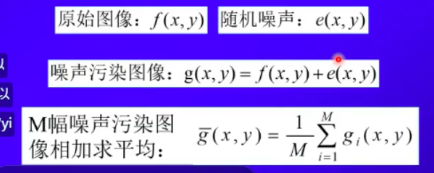
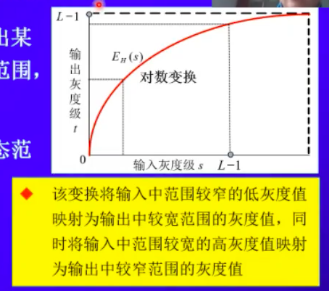
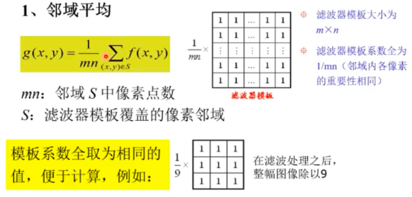
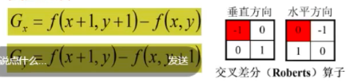
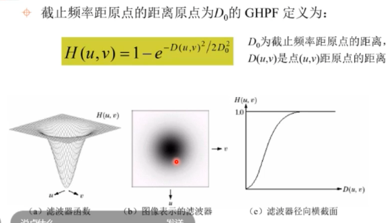
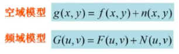
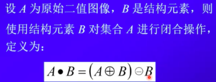
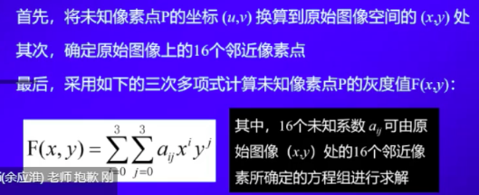
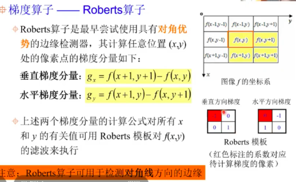
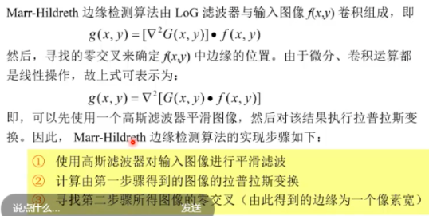

## where is digital image come from?

Digital camera 

## what is digital image processing?

### gamma ray imaging (high energy)

Medical 

SPECT imaging (single photo emission CT computer tomography)

PET imaging(position emission tomography )

Car inspection 

### X-ray imaging (a little lower energy )

#### Medical 

 (blocked by patient's bones so the detector can get a x-ray image)  can find if there is a tumor in ur body

#### Airpot

 for baggage screening 

#### Use in:

CT scan  ; computed tomography

### ultraviolet imaging(紫外线图像)(10-100ev)

#### use in:

different kind of microscopy (显微镜) especially fluorescence microcopy (荧光显微镜)

u have some sort of sample on a slide and the sample with fluorescence  dye then shine uv light onto the sample  

-------------------------------------------------------------------------------------

------

# 数字图像基础

## 什么是数字图像

**图像**：照片、图片、景物、文字等等能够转化为==视觉信息==的东西

> "one picture is worth more than ten thousand words" 

### 连续图像

一般情况下，我们感兴趣的多数图像都是由==照射源==和形成图像的==场景元素==对<u>光能的反射或吸收</u>而产生的，是==连续==的==模拟图像==，其==幅值与坐标都是连续的==

### 数字图像

将一幅二维的连续图像通过有限个离散点来表示即为==数字图像==，此过程叫做==数字图像的采集==。其中每个点称为图像元素，即==像素==（像马赛克）

*计算机存储不了连续图像*

### 图像采集

成像系统所产生的图像是由一系列的模拟信号所组成的，这些模拟信号的幅值与空间坐标都是连续的。为了产生数字图像，需要把连续的模拟信号转换为数字形式，即为==图像采集==

图像采集包括两种处理：==采样==和==量化==


**采样**：对连续图像的空间坐标值进行数字化，即离散化

**量化**：对连续图像的幅值进行数字化

### 图像的表示

##### 2-D数组（函数形式）：$f（x，y）$

$x，y$：2-D空间XOY中坐标点的位置

$f$：代表图像在$(x,y)$的性质$F$的数值，（即像素值，$f,x,y$的值可以是任意实数）。如在某一点处的灰度级

性质$F$:可对应不同物理量，如像素的灰度级、颜色、亮度值、透明度

##### 矩阵

矩阵中每一个值都为像素点

##### 矢量

### 图像类型

* #### 按灰度分类：

  * 二值图像：黑白图
  * 灰度图像

* #### 按运动分类：

  * 静态图像：包括静止图像和凝固图像（动态图像中的一帧）
  * 动态图像：由一组静态图像按时间的先后顺序排列组成

* #### 按色彩分类：

  * 单色图像：某一谱段的灰度图
  * 彩色图像：如RGB图像

### 像素值

#### 二值图像

对于二值图像而言，每个像素只有黑色和白色之分，其数值只能为0或1，0表示黑、1表示白。

#### 灰度图像

对于灰度图像而言，每个像素的亮度用一个数值（8bit）来表示，通常数值范围在0～255。0表示黑、255表示白，其他值表示处于黑白之间的灰度。

#### 彩色图像

彩色图像的像素可以用红、绿、蓝三元组来表示。通常，三元组的每个数值也是在0～255，0表示相应的基色在该像素中没有，255表示相应的基色在该像素中取得最大值。

### 图像处理中的坐标

#### 矩阵坐标

原点定义在图像的左上角的第一个位置，行坐标（垂直坐标）以向下为正，列坐标（水平坐标）以向右为正。用的更多一点

#### 直角坐标

原点定义在左下角，观看顺序与平常直角坐标系一样。一般不会用到

### 图像质量相关的指标

#### 空间分辨率

图像中==可分辨的最小细节==，是由采样过程（采样间隔）决定的（采样的点越多，细节就越多）。空间分辨率越高，图像可直接辨别的细节就越多

一般情况下就是图像大小

#### 灰度级分辨率

在灰度级别中==可分辨的最小变化==，是由量化过程决定的。灰度级越高，可以辨别的颜色变化就越细致。

通常把大小为M* N，灰度为L级的数字图像称为空间分辨率为M*N，灰度级分辨率为L的数字图像。

#### 对比度

指一幅图像中灰度反差的大小，对比度=最大亮度/最小亮度

#### 清晰度

与清晰度相关的主要因素：亮度、对比度、尺寸大小、细微层次、颜色饱和度

## 视觉系统对光的感知特点

**人眼适应的亮度范围**：总体范围大，具体范围小

**主观亮度影响**：相同亮度的物体，背景不一样时感觉的亮度就不同（即亮度对比度会发生变化）

**主观轮廓现象**

**空间错觉现象**

## 什么是数字图像处理

图像工程包括图像处理、图像分析、图像理解

#### 图像处理

改善图像的视觉质量


#### 图像分析

对图像中感兴趣的目标进行检测和测量，提取出对它进行描述的信息。输入是图像，输出可以是对图像描述的特征数据（如长度、面积等），或用符号表示的特征（如用a表示——，用b表示|）

#### 图像理解

在图像分析的基础上，找出各目标的性质以及它们之间的相互联系，最终得到对图像内容和含义的理解，以及对客观场景的解释。输入是图像，输出是对图像的解释。


### 数字图像处理的主要内容

图像采集、图像增强、图像复原、形态学处理、图像分割、对象识别、表示与描述、图像压缩、彩色图像处理

## 数字图像处理的应用

* **对比度增强**：医学中CT图更清晰
* **沙尘烟雾环境下图像增强**
* **图像去噪**
* **图像解模糊**：结果不确定，可能好也可能坏
* **信息不明显时提取信息**
* **黑暗时提取信息**
* **图像放大**
* **视频图像超分辨重建**（_重点关注_）
* **序列图像拼接**
* **图像修复**
* **做艺术效果、图像合成**
* **医学图像处理分析**：使用合适的滤波器来增强边缘
* **地理信息系统（GIS）**：气象学、地形分类、操作卫星图像
* **全球夜间灯光数据集**：可以提供全球人类居住区的汇总情况
* **印刷电路板检测**：使用机器检测零件是否完整以及焊接是否合格、常规成像和X光成像相结合
* **公共安全领域**：牌照识别、指纹识别、闭路电视中图像的增强
* **人机交互**：面部识别、手势识别

## 像素空间关系

### 像素间的联系

同一个很小的域内的像素点，差别很小，域越大，差别就越大

#### 像素的邻域（空间）

1. 4-邻域N~4~(p)：由4个标记为r的像素（正上、正下、正左、正右紧邻的，与p像素点空间坐标行或列只差1）所构成的集合
2. 对角邻域N~D~(P)：由4个标记为s的像素(p像素点的对角方向紧邻的四个像素点，与p像素点空间坐标行列各差1)所构成的集合
3. 8-邻域N~8~(P)：由8个标记为r、s的像素所构成集合（4-邻域+对角邻域）

#### 像素的邻接

邻接只考虑像素间的空间关系，即两个像素在空间上相互接触，则他们为邻接的

#### 像素的连接

连接包括邻接，还要看他们的灰度值是否满足某个特定的相似准则

设用V表示定义连接的灰度值集合

1. 4-连接：2个像素p和r在V中取值，且r在N~4~(P)中
2. 8-连接：2个像素p和r在V中取值，且r在N~8~(P)中

#### 像素的连通

若两个像素具有相同性质，且能够找到两两连接的一条通路，则称他们是==连通==的。

连通由一系列依次连接的像素组成

从具有坐标的像素p到具有坐标的像素q的一条通路由一系列具有坐标的独立像素组成

连接是连通的一种特例

#### 像素集合（图像子集）的邻接

对两个图像子集S和T来说，如果S中的一个或者一些像素与T中的一个或一些像素邻接，则称S和T邻接。

#### 像素集合（图像子集）的连通

是否是邻接图像子集；

图像子集中的邻接像素的灰度值是否满足某个灰度值相似准则

### 像素间的距离

* 两个像素之间的距离总是正的（非负性）
* 距离与起止点的选择无关（对称性）
* 最短距离是沿直线的

#### 距离的度量函数

1. 欧式距离D~E~(p,q)


与坐标为$（x，y）$的像素$D$距离小于或等于某个值$d$的像素都包括在以$（x，y）$为中心，以d为半径的圆中

2. 城区距离D~4~(p,q)


与坐标为$（x，y）$的像素$D$距离小于或等于某个值$d$的像素都包括在以$（x，y）$为中心的菱形中

3. 棋盘距离D~8~(p,q)


与坐标为$（x，y）$的像素$D$距离小于或等于某个值$d$的像素都包括在以$（x，y）$为中心的正方形中

## 图像的空域增强

### 空域增强技术概述

**空域**：指由像素组成的空间（还有频域、小波域等）

图像的空域增强技术是指直接作用于图像像素的增强技术

#### 空域增强的模型

$g(x,y)=E~H~[f(x,y)]$其中$f（x，y）$为原始图像，g为增强后的图像，E~H~为增强操作

目的是为了改善图像的视觉质量，或将图像转换成更适合于人和机器处理分析的形式。

#### 空域增强技术的分类

1. 基于像素的空域增强  E~H~仅定义在某个像素$（x，y）$上

* 像素点操作：g(x,y)=P~xy~[f(x,y)]
  * 改变当前像素的灰度
  * 输入为当前像素的灰度，或者当前像素的位置
* 几何操作：(x^'^,y^'^) =M(x,y)
  * 改变当前像素的位置
  * 输入为当前像素的原始位置，M为集合地点映射函数

2. 基于模板的空域增强  E~H~定义在像素$（x，y）$的某个邻域上

  t = E~H~[ s ,n(s) ]，其中s、t分别为原始图像f和结果图像g在$（x，y）$处的灰度值，$n（s）$为图像f在以$（x，y）$为中心的邻域内像素的灰度值集合。

### 图像间的运算

#### 算术运算

对两幅图像的对应像素间逐像素进行运算（对像素值加减乘除），参与运算的图像大小要一致

##### 应用

* 加法运算和除法运算可以实现图像的去噪

（理想环境下，可以去除所有噪声，但是现实中是很难完全去除噪声的，因为噪声是完全随机的）



M越大，效果越好

* 加法运算可以实现图像叠加效果

* 减法运算可以实现很多

  如：医学图像的数字减影、运动跟踪和检测、污染检测、伪印章鉴别

* 乘法运算可以实现对图像的目标检测

### 直接灰度映射

#### 灰度映射原理

按照某种映射规则或变换函数，将图像中的每个像素点的灰度值转化成另一个灰度值。


如果变换曲线是一条过原点的直线，则变换前后灰度值不变。

#### 典型灰度映射

##### 图像求反

将原图灰度值翻转，黑变白、白变黑。函数为斜率为-1的直线


##### 分段线性增强*

基于像素的图像增强，即==图像的对比度（指一幅图像中灰度反差的大小，对比度=最大亮度/最小亮度）增强==，就是增强感兴趣的灰度区域，相对抑制不感兴趣的灰度区域。分段线性增强用于拉伸感兴趣的图像细节的灰度级，同时压缩不感兴趣的图像细节的灰度级，即增强图像细节之间的对比度。

分段线性增强的典型变换函数是三段线性变换函数：


<u>斜率为1时，不会变化；斜率小于1时，相当于压缩灰度范围，即对比度下降；斜率大于1时，相当于拉伸灰度范围，即对比度提升。</u>

##### 对数变换

原图动态范围太大，超出某些显示设备的允许动态范围，需要压缩其动态范围。

常采用对数变换实现动态范围的压缩，$t = C log（1+|s|）$其中，C为尺度比例常数。

可以使用对数变换来==扩展图像中的暗像素的值，同时压缩高灰度级的值==，即提高暗处的对比度，降低明亮处的对比度。



##### 幂律（伽马）变换

一般形式：$t=c*s^r$,其中c和r为正常数

作用：r<1的幂律曲线与对数变换的曲线类似，将较窄范围的暗色输入值映射为较宽范围的输出值，同时，将较宽范围的亮色输入值映射为较窄范围的输出值。r>1时，压缩暗区域的对比度，同时提升亮色区域的对比度。<u>(r>1和r<1的幂律变换效果完全相反)</u>


##### 灰度切割（灰度级分层）

目的：增强特定范围的对比度，用来突出图像中特定灰度范围的亮度。

方法一：对感兴趣的灰度级以较大的灰度值显示，其他的为较小的灰度级显示。


方法二：对感兴趣的灰度级以较大的灰度值显示，其他不变。


##### 阈值化处理（阈值变换）

目的：将感兴趣的物体从背景中分离出来

阈值化处理需要指定一个阈值S~1~,根据这个阈值修改图像的像素值，最终产生一个黑白图像。


##### 位图切割

原理：假设图像的像素由8位（比特）表示其灰度值，则图像可以看成由8个单独的1比特平面（简称为位面）组成，其范围从最低有效位的位面0到最高有效位的位面7.

其中，每个位面均为二值图像，且位面图像中像素的灰度值等于有效位的取值，即：位面0表示最低位面，仅包含图像中像素的最低位；位面7表示最高位面，仅包含图像中像素的最高位。


目的：通过操作图像的特定位面来达到对图像的增强效果；可以确定用于量化该图像的比特数的充分性；有助于实现对图像的压缩（在图像压缩中，重建一幅图像时所用的位面比全部位面要少）

实现方法：

将图像各像素的灰度值除以各有效位的权值$2^i$（i为有效位的序数，从0计数），如果商的整数部分为奇数，则该灰度值在相应位面中映射为1；如果商的部分为偶数，则映射为0，即可得到每个位面的二值图像。

### 直方图修正（直方图均衡化）

#### 直方图

图像的一种统计表达，反映了图像中像素的灰度值的分布情况，定义为：h(k) = n~k~  k=0,1,2...L-1,其中n~k~是图像$f（x，y）$中具有灰度值k的像素的个数。


##### 直方图的应用

假设某图像的灰度直方图具有二峰性，则表明这个图像较亮的区域和较暗的区域可以较好地分离，取二峰间的谷底为阈值点，可以得到好的二值化处理效果。

##### 归一化直方图


##### 累积直方图


##### 归一化累积直方图


#### 直方图均衡化原理

把图像的直方图变换为均匀分布的形式，以此增强动态范围偏小的图像的反差，从而达到对比度增强。

选用合适的增强（变换）函数来修正图像灰度级的归一化直方图，从而得到新的灰度级分布图。

增强函数往往根据需要来选择，为了能从图像中获得尽量多的信息量（即图像熵尽可能大），要求p（s~k~）为常数，即所谓直方图均衡化。

增强函数需要满足的条件：（反变换也要满足）

* E~H~(s)必须为单值单增函数，其中0<=s<=L-1，==各灰度级在变换后仍保持原有的排列次序==（大的还大，小的还小）
* 0<=E~H~(s)<=L-1，==变换前后灰度值动态范围一致==

累积分布函数（CDF）满足以上的两个条件并能将输入值s的分布转换为输出值t的均匀分布


### ==空间==滤波机理

**空间滤波器的组成**：一个==邻域==（最典型的是一个较小的矩形）；对该邻域内的像素所要执行的==预定义操作==

滤波产生一个新像素，新像素的坐标等于邻域中心的坐标，新像素的值是滤波操作的结果。

滤波器的中心访问输入图像中的每个像素，就生成了滤波后的图像。

如果对邻域内的像素执行的是线性操作，则该滤波器称为线性空间滤波器；否则，滤波器就称为非线性空间滤波器。

#### 技术分类

##### 平滑滤波

*平滑滤波器模板系数之和为1*

平滑线性空间滤波器使用滤波器模板确定的邻域像素的平均灰度值代替邻域中心像素的值，这种处理的结果==降低了图像灰度的“尖锐”变化==。

应用：降低噪声（典型的随机噪声由灰度级的急剧变化组成；模糊处理

影响：带来图像边缘模糊的负面效应

##### 锐化滤波

*锐化滤波器模板系数之和为0*

目的：

* ==削弱图像中灰度值缓慢变化的区域，同时使图像中灰度值发生突变（灰度值存在明显反差）的区域得到增强或者保持不变==；
* ==消除图像中的低频分量，同时增强（or不影响）高频分量==。低频分量对应图像中灰度值缓慢变化的区域，因而与图像的整体特性（如整体对比度和平均灰度值等）有关。

效果：==增强被模糊的细节或目标的边缘弱化背景==。

但是噪声也属于图像的细节，很容易对噪声进行放大

平滑和锐化的作用是相反的

#### 实现原理

模板卷积（==卷积其实就是加权求和==）

使用大小为m*n的滤波器对大小为M *N的图像进行线性空间滤波，对于图像中的任意一点，滤波器的响应时滤波器系数与该滤波器所覆盖像素点的像素值的乘积之和


算法步骤：

1. 将滤波器在图像中漫游，并将滤波器中心与图像中某个像素位置重合；
2. 将滤波器中的各个系数与滤波器所覆盖的各对应像素的灰度值相乘；
3. 将上一步中所有乘积结果进行相加，并将加法运算的结果赋给图像中对应滤波器中心位置的像素（滤波器的输出响应）


#### 具体的滤波器模板

不一定全是方形的

##### 邻域平均



缺点：使图像产生模糊，邻域越大，模糊越厉害

##### 加权平均

滤波器模板中各个位置的系数（权值）采用不同的数值

* 离模板中心近的像素权值越大
* 离模板中心远的像素权值越小

#### 非线性滤波器

##### 统计排序滤波器

统计排序滤波器是一类经典的非线性空间滤波器

统计排序滤波器的响应以滤波器所覆盖的图像区域中的所有像素的排序为基础，然后使用统计排序的结果值代替中心像素的值。

统计排序滤波器具备优秀的去噪能力，而且比相同尺寸的线性平滑滤波器的模糊程度明显要低。

###### 中值滤波器

最常用的统计排序滤波器，它使用像素邻域内灰度的中值代替邻域中心像素的值。

主要功能：使拥有不同灰度的像素点看起来更接近于它的相邻点（即==去除那些相对于其邻域像素更亮或更暗孤立像素==）

中值滤波器对处理椒盐噪声（以黑白点的形式叠加在图像上）非常有效。

**实现步骤**

1. 将滤波器模板在图像中漫游，并将模板中心于图像中某个像素位置重合
2. 读取模板下各对应像素的灰度值
3. 将这些灰度值按从小到大（or从大到小）的次序进行排序
4. 确定排序结果的中值，并将此中值赋予对应模板中心位置的像素

###### 百分比滤波器

分为最大值滤波器和最小值滤波器


“椒”噪声（暗的）有较低的灰度值，用最大值滤波器有较好的效果；“盐”（亮的）有较高的灰度值，用最小值滤波器效果好。

###### 中点滤波器

中点滤波器以滤波器所覆盖的像素邻域的最大灰度值和最小灰度值的均值作为输出值，即


中点滤波器结合了排序统计和求平均，对于高斯和均匀分布随机噪声有较好效果

##### 非线性锐化滤波器

锐化处理的主要目的是突出图像中灰度的过渡部分

图像的锐化处理可以用空间微分来完成（微分算子的响应程度与像素的突变程度成正比），也即，图像微分增强边缘与其他突变（like噪声、线），并削弱灰度变化缓慢的区域。

常用的非线性锐化滤波器

* 基于一阶微分的锐化滤波器

  **要求**：在恒定灰度区域的一阶微分值为0；在灰度台阶、灰度斜坡的起点处一阶微分值非0；沿着灰度斜坡的一阶微分值非0

* 基于二阶微分的锐化滤波器

  要求：在恒定灰度区域的二阶微分值为0；在灰度台阶、灰度斜坡的起点处二阶微分值非0；沿着灰度斜坡的二阶微分值为0

数字图像中，常用差分来计算微分值：


对二维的数字图像，可以沿着两个空间皱处理偏微分

###### 基于一阶微分的锐化滤波器---梯度算子

在图像处理中，基于一阶微分的锐化滤波器常用==梯度幅值==来实现


**数字图像的梯度（一阶微分）的近似计算方法（滤波模板）：**（所有模板的系数之和为0）

1. 直接差分

   

2. 交叉差分

   

3. Sobel算子（卷积）

   

###### 梯度算子的应用：

梯度处理经常应用于工业检测、辅助人工检测缺陷，或者是更为通用的自动检测的预处理

###### 总结：

==梯度值正比于邻近像素灰度值的差分==，因此在图像变化缓慢区域，其值很小；而在灰度急剧变化的部分（图像的细节，如边缘）其值很大，这就是图像经过梯度计算可使其细节清晰从而达到锐化目的的实质。

###### 基于二阶微分的锐化滤波器---拉普拉斯算子


参与计算的其他像素点正好是位于中心店正上、下、左、右的像素点

扩展：


###### 总结：

拉普拉斯算子强调图像中灰度的突变，同时降低灰度缓慢变化的区域，使用拉普拉斯变换对图像进行增强的基本方法可以表示为：

将原始图像和拉普拉斯图像叠加在一起，以增强原始图像的细节，同时又保护了原始图像的背景信息。

### 混合空间增强法

如果所给的原始图像的灰度动态范围很窄并且伴随着很高的噪声，如果采用单一的图像增强法很难对其进行增强。

## 图像变换

### 为什么要对图像进行变换

为了有效和快速地对图像进行处理，常常需要将原定义在空域的图像以某种形式转换到另外一些空间，并利用在这些空间的特有性质进行一定的处理，最后再转换回空域以得到所需的效果。

变换是双向的（or需要双向的变换）

* 一般将图像从空域向其他空间的变换称为正变换；
* 将图像从其他空间向空域的变换称为反变换or逆变换。

### 傅里叶变换

基本思想就是累加

#### 一维连续傅里叶变换及反变换


#### 一维连续傅里叶变换及反变换


#### 一维离散傅里叶变换（DFT）及反变换


#### 二维离散傅里叶变换及反变换


**关于频谱$|F(u,v)|$的说明：**

频谱描述了图像中某种频率的成份数量；

频谱中出现的明亮线反映了原始图像的灰度级变化方向（即图像的轮廓线or由灰度急剧变化来表征的内容，其方向与频谱中的明亮线相互垂直）。


#### 傅里叶变换的性质

1. 平移性质

2. 分配律

3. 线性性质

4. 旋转性

5. 周期性和共轭对称性

6. 可分离性

   

   上式中，$F(x,v)$是沿着$f(x,y)$的一行所进行的FT结果；

   当$x=0,1,2,...,M-1$，则沿着$f(x,y)$的所有行计算FT

   

7. 平均值

   图像在原点处的FT等于图像的平均灰度级，可以通过将u，v都取0得到

8. 卷积

9. 相关性

### 为什么需要快速傅里叶变换（FFT）

传统算法时空复杂度比较高，FFT算法复杂度低了

### 频率域滤波

#### 为什么要在频率域研究图像增强

可以利用频率成分和图像外表之间的对应关系（一些在空闭域表述困难的增强任务在频率域中变得非常普通）

滤波在频率域更为直观，它可以解释空间域滤波的某些性质。利用这些性质进行一定的处理，最后再转换回图像空间，可以得到所需的效果

空间域和频率域中的滤波器组成了傅里叶变换对。可以在频率域指定滤波器，并对其执行反变换，最后在空间域使用该反变换的结果作为空域滤波器

#### 傅里叶变换的频率分量和图像空间特征之间的联系

变化最慢的频率成分（u=v=0）对应图像的平均灰度级：

当从变换的原点移开时，低频成分对应着图像中灰度慢变化的分量（like图像的平滑部分）

进一步偏离原点时，较高的频率成分对应图像中变化越来越快的灰度（like边缘or噪声等尖锐部分）

#### 基本思想

使用频域滤波器函数对原始图像的频谱进行滤波，然后对该滤波结果执行傅里叶反变换来获得处理后的输出图像

#### 步骤


#### 频域滤波器如何作用于图像

图像就是由灰度的恒定区域or缓慢变换区域加上细节部分。细节就对应图像的前景部分即频谱的高频成分，灰度恒定区域or缓慢变换区域对应图像的背景部分即频谱的低频成分

##### 低通（平滑）滤波器

==使频谱的低频成分通过，同时使其高频成分衰减==

被低通滤波的图像比原始图少了尖锐的细节部分（如噪声、边缘 等）但==突出了平滑过渡部分==，对应于空间域滤波的平滑处理如均值滤波器

###### 理想低通滤波器（ILPF）

尖锐

（太理想了，实际中不可能实现）能够把所有低频成分（小于截止频率的），完完全全保留下来。


低频成分与高频成分没有过渡，直接就是一个高频一个低频


**结论**：理想低通滤波器产生模糊和振铃现象，且与截止频率成反比（截止频率越大，模糊和振铃现象越弱，因为大部分信息都流下来了）

###### 巴特沃斯低通滤波器（BLPF）

（处于理想和高斯滤波器之间）


BLPF没有明显的振铃现象，不过随着阶数变大，振铃现象会越明显，越接近于理想低通滤波器

随着截止频率（滤波器半径）的增大，模糊会越来越弱

###### 高斯低通滤波器（GLPF）

平滑


高频与低频之间的过渡更加平滑

高斯滤波器的模糊现象比巴特沃斯滤波器还弱，也没有出现振铃现象，但是平滑性不如相同截止频率的二阶巴特沃斯滤波器

###### 应用实例

模糊、平滑

* 字符识别：用于机器识别系统识别字符的预处理。通过模糊图像，桥接断裂字符的裂缝（但是会使整幅图像都变模糊）
* 印刷和出版业：从一幅尖锐的原始图像产生平滑、柔和的外观。如人脸，减少皮肤细纹的锐化程度和小斑点。
* 处理卫星和航空图像：尽可能模糊细节，从而保留大的可识别特征（低通滤波通过消除不重要的特征来简化感兴趣特征的分析）

##### 高通（锐化）滤波器

==使频谱的高频成分通过，同时使其低频成分衰减==

 被高通滤波的图像比原始图少了灰度级的平滑过渡，但==突出了边缘等细节部分==，对应于空间域的锐化处理如梯度算子、拉普拉斯算子

###### 理想高通滤波器（IHPF）：

和理想低通滤波器互补，振铃现象更明显


###### 巴特沃斯高通滤波器（BHPF）：

和巴特沃斯低通滤波器互补，锐化效果更好，边缘失真小很多


###### 高斯高通滤波器（GHPF）：

和高斯低通滤波器互补，比BHPF和IHPF锐化效果更好，即使是对微笑物体和细线条的滤波也是较清晰的，不会产生振铃现象



##### 高通滤波器与低通滤波器的关系：

互补


被低通滤波器衰减的频率成分能通过高通滤波器，反之亦然。

##### 高频提升滤波和高频加强滤波：

为什么要进行高频提升和高频加强？

高通滤波效果等同于用原始图像的频谱减去低通滤波的结果图像频谱

**存在的问题：**图像经过高通滤波后，其背景的平均灰度减弱到接近黑色（因为高通滤波器除去了傅立叶变换的零频率成分对应于图像的平均灰度值也就是图像的背景，即背景没了只剩细节）

**解决方法：**把原始图像加到滤波后的结果图像中，即高频提升滤波or高频加强滤波

###### 高频提升滤波：

目的：将原始图像按照一定比例加到滤波后的结果中，以保留原始图像的背景。

实现方法：


###### 高频加强滤波：

目的：加强增强图像的高频成分

实现方法：


## 图像复原

### 图像退化/复原过程的模型

#### 图形退化

是指图像在形成、存储、处理和传输过程中，由于成像系统、存储设备、处理方法和传输介质的不完善，从而导致的==图像质量下降==。

#### 引起图像退化的原因：

* 成像系统的散焦
* 成像设备与物体的相对运动
* 外部干扰
* ......

退化系统实例：大气湍流引起图像模糊；摄像机运动

#### 图像复原

图像复原也叫图像恢复，指的是对退化的图像进行处理，试图恢复降质的图像，还原真面目

#### 复原与退化的关系

==图像复原可以看作是图像退化的逆过程==，是将图像退化的过程加以估计，建立退化的数学模型后，补偿退化过程造成的降质

在退化过程确知的情况下，图像退化的逆过程是有可能进行的。但实际情况经常是退化过程不知晓，这种复原称为盲目复原

由于图像模糊的同时，噪声和干扰也会同时存在，也为复原带来了困难和不确定性

#### 图像复原与图像增强的比较

* 相同点
  * 都是为了改善图像质量
  * 都可以使用空间域or频率域滤波实现
* 不同点
  * 图像增强主要是一个主观过程，图像复原是一个客观过程
  * 图像复原是根据相应的退化模型和知识来估计能恢复原始图像的最优值；图像增强是一个简单的对比度拉伸，提升图像的视觉质量

#### 图像退化/复原模型


### 噪声模型

噪声是图像中不希望有（or不需要）的部分，是最常见的退化因素之一

对信号来说，噪声是一种外部干扰（但噪声本身也是一种信号，携带了噪声源的信息）

数字图像的噪声主要来源于图像的==获取==和==传输==过程

* 获取图像的数字化过程，如图像传感器的质量和环境条件
* 图像传输过程中传输信道的噪声干扰，如无线网络传输的图像会收到光or其他大气因素的干扰

#### 噪声的模型

图像中的噪声是随机的，其灰度值的统计特性可以用概率密度函数（PDF）or相应的累积分布函数（CDF）进行表征

噪声图像的直方图和对应噪声概率密度函数的曲线相似

对于退化图像的噪声，有多种不同的统计模型：

##### 均匀噪声（Uniform noise）


##### 指数噪声（Exponential noise）


##### 高斯噪声（Gaussian noise）


##### 瑞利噪声（Rayleigh noise）


##### 伽马噪声（爱尔兰噪声）


（E~i~的值就是指数噪声的z的形式）

##### 脉冲噪声（椒盐噪声）


##### 周期噪声

### 空间域滤波复原

当一幅图像中存在的唯一退化因素是噪声时，其退化模型为：



可以选择空域滤波的方法来复原图像，常见的空域滤波器有均值滤波器、中值滤波器、最大值滤波器、最小值滤波器、中点滤波器以及自适应滤波器等

均值滤波器和中点滤波器适合于处理高斯or均匀等随机噪声

中值滤波器适合于处理椒盐噪声

最大值滤波器适合于处理“椒”噪声

最小值滤波器适合于处理“盐”噪声

#### 自适应滤波器

这类滤波器的自适应滤波行为基于由m*n矩形窗口S~xy~

定义的区域内图像的统计特征

与前述滤波器相比，该类滤波器性能更优，但也增加了算法的复杂性

该类滤波器的响应基于以下4个量：


### 退化函数的估计

#### 图像复原的主要目的

频域退化模型：

在给定退化图像以及退化函数和噪声的前提下，对原始图像进行估计

#### 退化函数的一般估计方法

在进行图像复原时首先估计退化函数（点扩散函数，PSF），一般的估计方法有三种：**图像观察估计法**、**试验估计法**、**模型估计法**

##### 图像观察估计法

在没有关于退化函数的先验知识的情况下，通过收集图像自身的信息，从而实现退化函数的估计：


##### 试验估计法

使用与退化图像的成像设备相似的装置，以此装置成像一个脉冲（即小亮点），得到一个退化的冲击效应，从而实现较准确的退化估计：（很难实现）


##### *模型估计法

从基本原理开始，推导一个数学模型，以此数学模型建立退化函数的估计

1. 散焦模糊（Disk Blur）

   

2. 运动模糊（motion delur）

   

3. 大气湍流模糊

   

   将引起退化的环境因素考虑在内；k越大，湍流越剧烈，模糊越严重

### 常见的图像复原方法

#### 逆滤波

逆滤波是复原退化图像最简单的方法，即利用退化图像的傅立叶变换结果除以频域退化函数：


优点是算法简单，但是缺点是没有考虑噪声的影响，结果是不准确的

#### 维纳滤波

综合了退化函数和噪声统计特性两个方面进行复原处理

引入最小二乘约束条件，使得复原的结果图像与原始的未退化图像之间的均方误差（灰度值的误差的平方和的均值）最小


#### 比较：

逆滤波算法简单，但去模糊能力不强，且忽略噪声影响；

维纳滤波去模糊效果优于逆滤波，且具备去噪能力，但需要知道未退化图像和噪声的功率谱；

维纳滤波建立在最小化统计准则的基础上，滤波结果只是平均意义上的最优

## 形态学图像处理

### 概述

形态学：是生物学中研究动植物结构的一个分支

数学形态学（图像代数）：以形态为基础对图像进行处理（分析）的数学工具

形态学图像处理的作用：可以简化图像数据，去除图像中不重要的结构，仅保持图像的基本形状特性（如桥接断裂图像间的间隙时只对断裂的部分操作）

基本思想：使用具有一定形态的结构元素去度量和提取图像中的对应形状，以达到对图像进行处理和分析的目的

数学知识：集合论

基本操作：膨胀、腐蚀、开启、闭合

### 集合论

#### 并、交、补、差

和数学中的一样

#### 反射与平移


集合与其反射关于原点中心对称


#### 二值图像的逻辑运算

与：and（交）都为1时才为1，其他情况都为0；

或：or（并）有1就为1；

非：not（补）0变为1、1变为0；

异或：xor  两个不相同时为1，都相同为0

### 二值图像形态学处理的基本概念

运算对象是集合 

 设A为像素集合，B为结构元素（本身也是一个像素集合，其成员是图像中感兴趣目标的像素，即前景像素点，like二值图像中为1的点），其处理过程是用B对A进行操作

B对A的具体操作

 通过让B在A上平移，以便B的原点访问A的每一个元素，以此得到一个新的像素集合

结构元素必须指定一个原点

 结构元素的原点是形态学运算的参考点（当结构元素对称且未显示原点时，通常假定原点位于对称中心处）

对图像进行操作时，要求结构元素是矩形阵列（对不是矩形的，通过添加一些背景元素来形成矩形

注意，原点可以包含在结构元素中，也可以不包含在结构元素中（结构元素原点的位置不同，运算结果也不相同）

### 膨胀和腐蚀

#### 膨胀（dilation

效果：扩大图像中的物体

定义：设A为原始二值图像，B是结构元素，则A被B膨胀定义为：

即，A被B膨胀的结果是满足上式的所有位移z的点（前景像素点）的集合（B经过反射又平移z单位后与A有交集的所有B对应的中心元素）

eg：

应用举例：桥接裂缝


#### 腐蚀（erosion

效果：缩小图像中的物体

定义：设A为原始二值图像，B是结构元素，则A被B腐蚀定义为：


eg：

腐蚀在数学形态学运算中的作用：

如果结构元素取3*3的方块，腐蚀将使物体的边界沿周边减少一个像素

腐蚀可以去除小于结构元素的物体（like毛刺、小凸起等）选取不同大小的结构元素，可以在原图像中去掉不同大小的物体

如果两个物体之间有细小的连通，那么当结构元素足够大时，通过腐蚀运算可以将两个物体分开

应用实例：


### 开启和闭合

#### 开启（opening）

效果：断开较窄的狭颈、消除细的突出物，使图像的轮廓变得光滑

```matlab
A = imread('shapes.tif');
B=strel('square',20);//结构元素
result_open=imopen(A,B);
result_close=imclose(A,B);
result_open_close=imclose(result_open,B);
```

定义：

即，==先用B对A腐蚀，然后用B对腐蚀结果膨胀==

开启实例：


性质：


（3的意思是多次开启的结果与一次开启结果相同）

#### 闭合（closing）

效果：填补狭窄的间断、小的孔洞，使图像的轮廓变得光滑

imclose

定义：

即，==先用B对A膨胀，然后用B对膨胀结果腐蚀==

闭合实例：


闭合性质：


### 形态学的主要应用：

#### 边界提取

图像A的边界可以由B先对A腐蚀，再用A减去腐蚀得到

#### 孔洞填充

孔洞：由前景像素相连接的边界所包围的一个背景区域

实现：


#### 骨架抽取

骨架的概念：是图像的一种细化结构（图像中的物体的骨骼部分），由物体的若干条细化的中轴线组成，描述了图像中物体的形状和方向信息

骨架的作用：

通过骨架抽取可以简化图像中物体的信息而保留其同伦结构；

有助于突出形状特点和减少冗余信息量；

在图像工领域有着广泛的应用（like形状分析、模式识别、数据压缩

骨架的定义：


骨架抽取的实现：


## 图像缩放

#### 图像缩放的变换公式

图像缩放是图像的一种形状变换，指图像中的像素点相对于坐标原点沿X方向和Y方向，分别按照比例系数C~x~和C~y~进行尺度的变换，其变换公式如下：


按比例缩放：水平、垂直方向的缩小比例相同

不按比例缩放：水平、垂直方向的缩小比例不同

#### 图像缩小的实现方法

图像缩小实际上就是对原有的多个样本进行挑选or处理，从而获得期望的缩小尺寸的样本，并且尽量保持原有的特征不丢失

最简单的方法就是等间隔地选取样本（重采样

步骤：

1. 确定重采样的行和列，即计算采样间隔（等于缩小系数的倒数）

2. 对原图像进行重采样，得到缩小后的新图像

   

#### 图像放大的实现方法

图像放大从字面上看，是图像缩小的逆操作。但是从信息处理的角度来看，则难易程度完全不一样

* 图像缩小是从多个信息中选出需要的信息
* 图像放大是需要对多出的空位填入适当的值，是信息的估计，较图像缩小更难

如果需要将原图像放大k倍，则将原图像中的每个像素值，填在新图像中对应的k*k大小的子块中（会形成马赛克效应 很模糊

算法步骤：

1. 计算放大后图像的大小

2. 求出放大的新图像像素值

   

**求新生成的点的像素值：**插值算法

最近邻插值：算法简单，插值结果不连续，视觉上锯齿效应明显

邻近的4个像素点的距离（一般算欧式距离

双线性插值：插值结果相对连续，视觉上比最近邻插值要平滑

在x方向上进行两次插值，再在y方向上进行一次插值 用权重

双三次插值：在保持细节方面比双线性插值相对要好，是商业图像编辑程序的标准插值方法

周围16个邻近像素点 




## 图像边缘检测

### 概述

**图像边缘的产生**：物体的边界、表面方向的改变、不同的颜色、光照明暗的变化

**图像边缘的定义**：一组相连的像素集合，这些像素位于两个不同区域的边界上

#### 边缘检测的意义：

边缘是图像最基本的特征之一，集中了图像的大部分信息

边缘特征对于图像的变化不敏感（几何变化、灰度变化、光照方向变化）

边缘检测是一种典型的图像预处理过程，可以为物体检测提供有用的信息（为图像场景识别与理解、图像分割等提供重要的特征）


#### 图像的边缘模型

根据图像的灰度剖面分类，边缘模型分为台阶边缘模型、斜坡边缘模型以及屋顶边缘模型

* 台阶边缘是指在1个像素的距离上发生两个灰度级间理想的过渡
* 实际中，图像都存在被模糊且带有噪声的边缘。在这种情况下，边缘被建模为斜坡边缘（有一个缓慢的过渡）模型，边缘点可能是斜坡中包含的任何像素点，即边缘的宽度不止1个像素宽
* 屋顶边缘是通过一个区域的线的模型，边缘的宽度由该线的宽度和尖锐度决定


#### 无噪图像的导数与边缘的关系


### 基本的边缘检测技术

为了达到检测边缘的目的，可以通过计算图像的一阶导数来完成。该类技术为基本边缘检测技术，所采用的工具就是梯度

#### 图像梯度及其性质


要得到图像的梯度，要求在图像的每个像素点处求偏导数，可以采用直接差分、Roberts、Prewitt、Sobel等算子近似实现

都是按照相应的模板来计算梯度（模板中的系数和为0）

#### 梯度算子

##### 直接差分


##### Roberts算子



##### Prewitt算子


##### Sobel算子


##### 用于检测对角边缘的Prewitt、Sobel算子


#### 先进的边缘检测技术

##### Marr-Hildreth（马尔-希尔德雷思）边缘检测器


为了改进提出了Marr-Hildreth（马尔-希尔德雷思）边缘检测算法

用于边缘检测的算子应该具备两个显著特点：

* 边缘检测算子应该是一个能计算图像中每一点处的一阶导数or二阶导数的数字近似的微分算子
* 边缘检测算子应该能被“调整”以便在任何期望的尺寸上起作用（大尺寸的算子可用于检测模糊边缘，小尺寸的算子可用于检测锐度集中的精细边缘）





##### 优缺点

优点：零交叉点图像中的边缘比梯度边缘细；抑制噪声的能力和反干扰性能较好

缺点：边缘由零交叉点构成，而零交叉点的计算比较复杂

##### Canny（坎尼）边缘检测器

目标是实现一个最优的边缘检测算法，其准则包括以下三个方面：

* 低错误率：所有边缘都应该被找到，并且应该没有伪响应
* 边缘点应被很好地定位：已定位的边缘必须尽可能接近真实边缘。也就是由检测器标记为边缘的点和真实边缘的中心之间的距离应该最小
* 单一的边缘点响应：对于真实的边缘点，检测器应返回一个点。也就是在仅存一个单一边缘点的位置，检测器不应输出多个边缘像素


##### 具体实现方法


