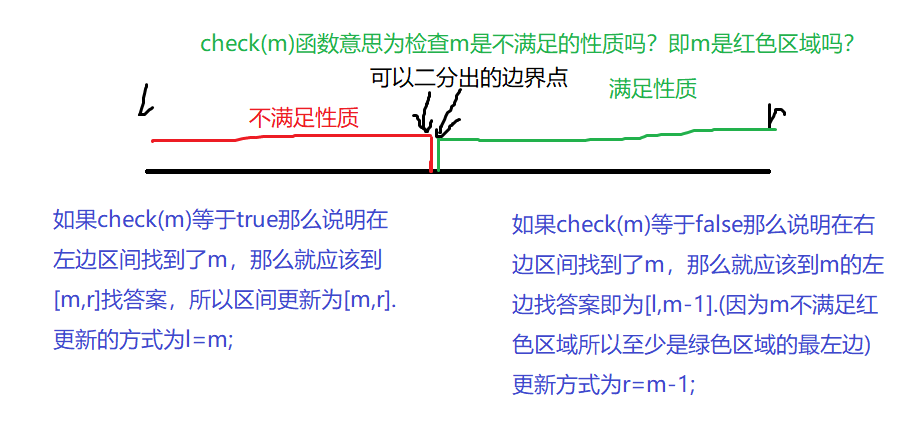
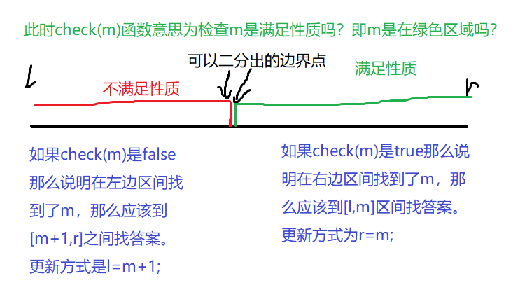

#  算法

## 排序

### 快速排序

**基于分治**

* 确定分界点x
* *调整区间*
* 递归地对左右两边进行前两步

 **代码：**

* [x] **785**

```c++
#include <iostream>
using namespace std;
const int N = 1000010;
int q[N];
void quick_sort(int q[], int l, int r)
{
    if (l >= r) return;//数组为空
    int i = l - 1, j = r + 1, x = q[(l+r)/2];//分界点
    while (i < j)
    {
        do i ++ ; while (q[i] < x);
        do j -- ; while (q[j] > x);
        if (i < j) swap(q[i], q[j]);//交换
    }
    quick_sort(q, l, j);//对分完的部分排序
    quick_sort(q, j + 1, r);
}
int main()
{
    int n;
    scanf("%d", &n);
    for (int i = 0; i < n; i ++ ) 
    {
        scanf("%d", &q[i]);
    }
    quick_sort(q, 0, n - 1);
    for (int i = 0; i < n; i ++ ) 
    {
        printf("%d", q[i]);
    }
    return 0;
}
```

* [x] **786 求第k个数**

```c++
```


### 归并排序

**还是分治的思想**

* 确定分界点（一般取中间点
* 先递归排序左右两边
* 把两边合并

```c++
#include <iostream>
using namespace std;
const int N = 1e6 + 10;
int a[N], tmp[N];
void merge_sort(int q[], int l, int r)
{
    if (l >= r) return;
    int mid = l + r >> 1;
    merge_sort(q, l, mid), merge_sort(q, mid + 1, r);
    int k = 0, i = l, j = mid + 1;//k表示已经合并的个数
  //合并子问题，一个一个判断
    while (i <= mid && j <= r)
        if (q[i] <= q[j]) 
        {
          tmp[k ++ ] = q[i ++ ];
        }
        else tmp[k ++ ] = q[j ++ ];
  //可能有的部分没有判断完
    while (i <= mid) tmp[k ++ ] = q[i ++ ];
    while (j <= r) tmp[k ++ ] = q[j ++ ];
  //temp里存的就是排好序的 现在把他赋值给q
    for (i = l, j = 0; i <= r; i ++, j ++ ) 
    {
      q[i] = tmp[j];
    }
} 
int main()
{
    int n;
    scanf("%d", &n);
    for (int i = 0; i < n; i ++ ) 
    {
      scanf("%d", &a[i]);
    }
    merge_sort(a, 0, n - 1);
    for (int i = 0; i < n; i ++ ) 
    {
      printf("%d ", a[i]);
    }
    return 0;
}
```

### 二分排序

#### 整数二分

> 一个题目,如果一个区间具有单调性质,那么一定可以二分,但是如果说这道题目没有单调性质,而是具有某种区间性质的话,我们同样可以使用二分.

给一个性质，将整个序列分为两部分

* 找分界点（中点
  *  看分界点是否满足性质，调整区间

当想找不满足性质的**边界值**（红色区域的右边界值）

找中间值 `mid = (l+r+1)/2`
`if(check(mid))`等于`true`或者是`false`
`check(m)`是检查m是在不满足性质的区间（检查是不是在红色区间）
更新l或者r



当想找满足性质的**边界值**（绿色区域的左边界值）
1. 找中间值 `mid = (l+r)/2`
2. `if(check(mid))`等于`true`或者是`false`
`check(m)`是检查m是在满足性质的区间（检查是不是在绿色区间）
3. 更新l或者r



归结上面的两种二分方法，步骤为：

先写一个`check`函数
判定在`check`的情况下（true和false的情况下），如何更新区间。
在`check(m)==true`的分支下是:
**`l=mid`的情况，中间点的更新方式是`m=(l+r+1)/2`**
**`r=mid`的情况，中间点的更新方式是`m=(l+r)/2`**
这种方法保证了：

1. 最后的l==r
2. 搜索到达的答案是闭区间的，即a[l]是满足check()条件的。

```c++
#include<iostream>
using namespace std;
const int N=100010;
int n,m;
int q[N];
int main()
{
    scanf("%d%d",&n,&m);//n是数的个数，m是要查找的数的个数
    for(int i=0;i<n;i++)
    scanf("%d",&q[i]);//q[i]是数组
    while(m--)
    {
        int x;
        scanf("%d",&x);//x是要查找的数
        int l=0,r=n-1;
        while(l<r)
        {
            int mid=(l+r)/2;
            if(q[mid]>=x) r=mid;
            else l=mid+1;
        }//问题的左边界，即第一个满足要查找的数的位置
        if(q[l]!=x) printf("%d %d\n",-1,-1);//如果走完了都没有和x相等的，输出-1 -1
        else
        {
            printf("%d ",l);
            int l=0,r=n-1;
            while(l<r)
            {
            int mid=(l+r+1)/2;
            if(q[mid]<=x)
            l=mid;
            else r=mid-1;
            }//问题的右边界，即最后一个满足要查找的数的位置
            printf("%d\n",l);
        }
    }
    return 0;
}
```

### 高精度

两个大整数（10^6）相加减、一个大整数乘除一个小整数

大整数存在数组里时，第一个位置存个位数字，依次增加

#### 791高精度加法 

```c++
#include<iostream>
#include<vector>//自带size函数表示数组长度
using namespace std;
//const int N=1e6+10;

vector<int> add(vector<int> &A,vector<int> &B)
{
  vector<int> C;
  int t=0;//进位
  for(int i=0;i<A.size()||i<B.size();i++)
  {
    if(i<A.size()) 
      t+ =A[i];
    if(i<B.size())
      t+ =B[i];
    C.push_back(t%10);
    t/=10;
  }
  if(t) C.push_back(1);
  return C;
}
int main()
{
  string a,b;
  vector<int> A,B;
  cin>>a>>b;//a=123456
  for(int i=a.size()-1;i>=0;i--)
    A.push_back(a[i]-'0');//A=[6,5,4,3,2,1]
  for(int i=b.size()-1;i>=0;i--)
    B.push_back(b[i]-'0');
  
  auto C=add(A,B);//自动判断变量类型
  
  for(int i=C.size()-1;i>=0;i--) 
    printf("%d",C[i]);
  return 0;
}
  
```

#### 791高精度减法

```c++
#include<iostream>
#include<vector>
using namespace std;
//判断是否有A>=B
bool cmp(vector<int> &A,vector<int> &B)
{
  if(A.size()!=B.size())
    return A.size() > B.size();
  for(int i=A.size()-1;i>=0;i--)
    if(A[i]!=B[i])
      return A[i]>B[i];
  return true;
}
//C=A-B
vector<int> sub(vector<int> &A,vector<int> &B)
{
  vector<int> C;
  for(int i=0,t=0;i<A.size();i++)
  {
    t=A[i]-t;
    if(i<B.size()) t= t-B[i];
    C.push_back((t+10)%10);
    if(t<0) t=1;
    else t=0;
  }
  while(C.size()>1 && C.back==0) C.pop_back();
  return C;
}
int main()
{
  string a,b;
  vector<int> A,B;
  cin>>a>>b;//a=123456
  for(int i=a.size()-1;i>=0;i--)
    A.push_back(a[i]-'0');//A=[6,5,4,3,2,1]
  for(int i=b.size()-1;i>=0;i--)
    B.push_back(b[i]-'0');
  
  if(cmp(A,B))
  {
    auto C=sub(A,B);
    for(int i=C.size()-1;i>=0;i--)
      printf("%d",C[i]);
  }
  else
  {
    auto C=sub(B,A);
    printf("-");
    for(int i=C.size()-1;i>=0;i--)
      printf("%d",C[i]);
  }
}
```

#### 792高精度乘法

```c++
#include<iostream>
#include<vector>

using namespace std;


```


